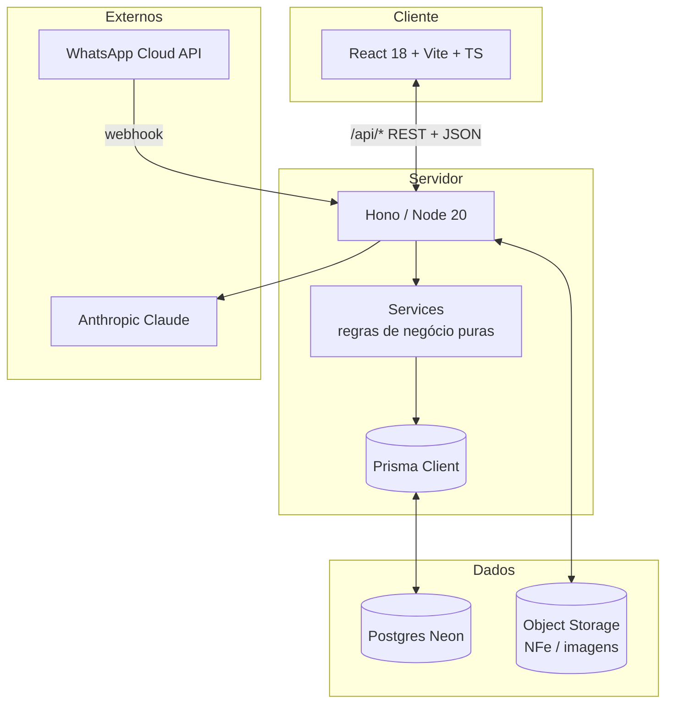
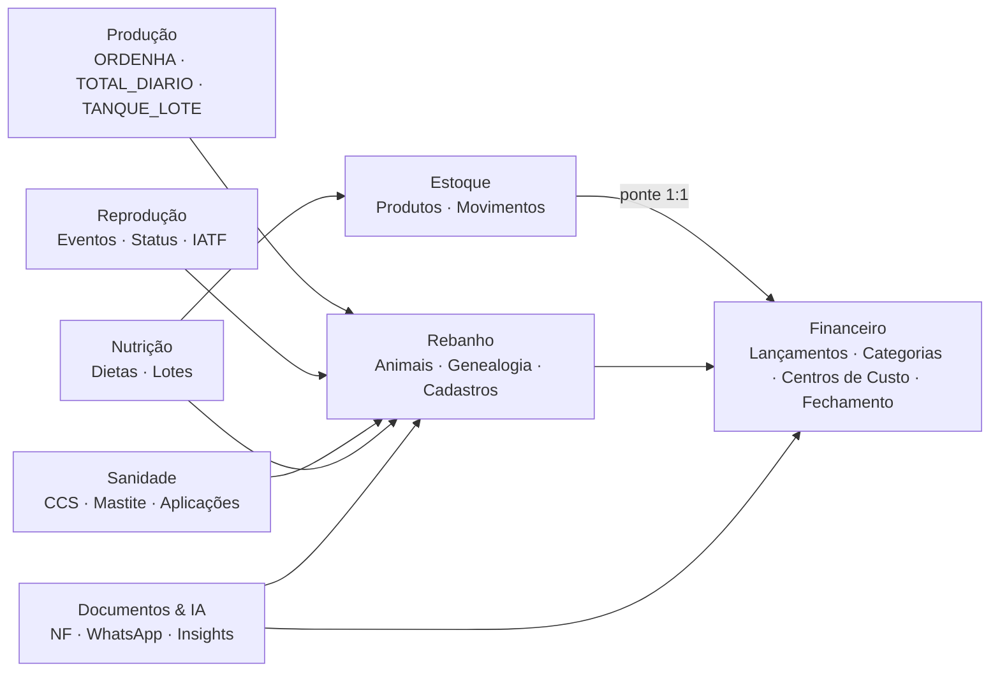
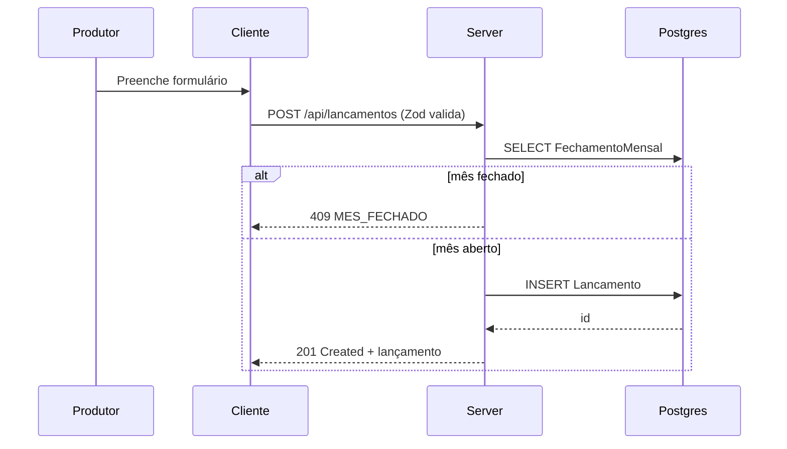
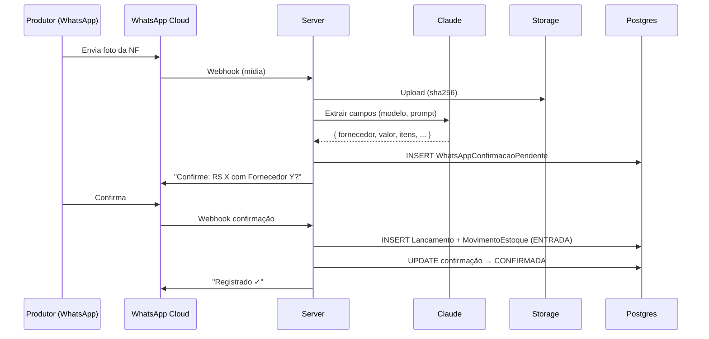
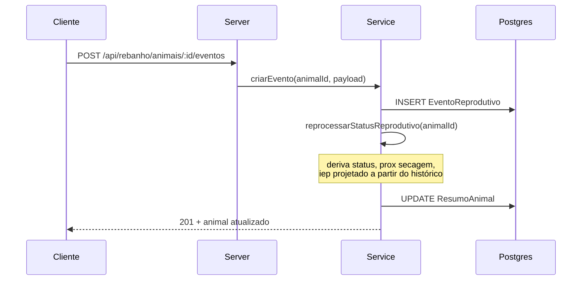

# ARCHITECTURE.md — Arquitetura do Sistema

> **Como o Fazendinha está organizado e por quê.**
> Este documento descreve a arquitetura *atual* e as **convenções obrigatórias** que mantêm o código coerente.

---

## Sumário

1. [Visão de alto nível](#1-visão-de-alto-nível)
2. [Stack e versões](#2-stack-e-versões)
3. [Bounded contexts](#3-bounded-contexts)
4. [Backend (Hono)](#4-backend-hono)
5. [Frontend (React + Vite)](#5-frontend-react--vite)
6. [Banco de dados (Postgres / Neon)](#6-banco-de-dados-postgres--neon)
7. [Fluxos críticos](#7-fluxos-críticos)
8. [Integrações externas](#8-integrações-externas)
9. [Convenções de código](#9-convenções-de-código)
10. [Testes](#10-testes)
11. [Build, deploy e ambientes](#11-build-deploy-e-ambientes)
12. [Escalabilidade e evolução](#12-escalabilidade-e-evolução)

---

## 1. Visão de alto nível



- **Monorepo pnpm**, dois workspaces: `client`, `server`.
- **Servidor stateless** em Hono — escala horizontal sem sessão local.
- **Banco serverless** Neon (pooled em runtime, direct para migrations).
- **Object storage** (S3/GCS via `storageDriver` em models) para notas fiscais e mídias.
- **IA externa** (Claude) acionada via SDK oficial.

---

## 2. Stack e versões

| Camada | Tecnologia | Versão (atual) |
|---|---|---|
| Runtime | Node.js | **20+** (suporte nativo `--env-file`) |
| Package manager | pnpm | **10+** |
| Backend | Hono | 4.6.15 |
| Adapter | `@hono/node-server` | 1.13.7 |
| Validação | Zod | 3.24.1 |
| Validador HTTP | `@hono/zod-validator` | 0.4.2 |
| ORM | Prisma | 6.1.0 |
| Cliente IA | `@anthropic-ai/sdk` | 0.104.2 |
| Frontend | React | 18.3.1 |
| Build | Vite | 6.0.7 |
| Tipos | TypeScript | 5.7.3 |
| Testes | Vitest | 2.1.8 |

ESM em **todos os pacotes** (`"type": "module"`).

---

## 3. Bounded contexts

A modelagem segue uma divisão em **contextos de domínio**. Cada contexto tem seu próprio conjunto de tipos, regras e fluxos. Cruzar contexto só por contrato explícito (DTOs e IDs).



### Pontes (deliberadas)

- **Estoque → Financeiro:** toda `ENTRADA` de produto cria um `Lancamento` espelhado (`MovimentoEstoque.lancamentoId`). Relação 1:1.
- **Sanidade → Estoque:** `APLICACAO` de medicamento deveria gerar uma `SAIDA` de estoque (futuro/em pavimentação).
- **Rebanho → Financeiro:** custo de produção (`R$/litro`) combina lançamentos do CCusto `Atividade Leiteira` com produção de leite.

### Regra de ouro

> **Mudança em um contexto não pode quebrar outros silenciosamente.** Toda alteração de schema cruzando bounded contexts deve passar por revisão de domínio + ajuste de fluxos.

---

## 4. Backend (Hono)

### Estrutura de pastas

```
server/src/
├── index.ts              # bootstrap + middlewares + monta routers
├── env.ts                # Zod schema do .env, fail-fast
├── db.ts                 # PrismaClient singleton HMR-safe
├── routes/               # roteamento Hono por domínio
│   ├── health.ts
│   ├── dashboard.ts
│   ├── categorias.ts
│   └── rebanho/
│       ├── animais.ts
│       ├── eventos.ts
│       ├── producao.ts
│       ├── sanidade.ts
│       ├── estoque.ts
│       ├── nutricao.ts
│       ├── cadastros.ts
│       ├── config.ts
│       ├── ia.ts
│       ├── dashboard.ts
│       ├── custo-producao.ts
│       └── custo-sanidade.ts
└── services/             # lógica de negócio (sem HTTP, sem Prisma direto onde possível)
    ├── dashboard.ts
    └── rebanho/
        ├── animais.ts
        ├── eventos.ts
        ├── eventos-sanidade.ts
        ├── producao.ts
        ├── producao.recompute.ts   # puro
        ├── estoque.ts
        ├── estoque.calc.ts         # puro
        ├── nutricao.ts
        ├── cadastros.ts
        ├── config.ts
        ├── insights.ts             # score 0-100 + financeiro animal
        ├── dashboard-rebanho.ts
        ├── dashboard.agg.ts        # puro
        ├── timeline.ts
        ├── ponte.calc.ts           # puro
        ├── reproducao.recompute.ts # puro
        ├── sanidade.recompute.ts   # puro
        ├── ia.ts ia.context.ts ia.llm.ts ia.responder.ts
        ├── types.ts                # DTOs canonicos
        └── *.schemas.ts            # Zod schemas
```

### Padrões obrigatórios

1. **Chained routes Hono** para preservar tipagem.

   ```ts
   import { Hono } from "hono";
   const router = new Hono()
     .get("/", listar)
     .post("/", criar)
     .patch("/:id", atualizar);
   export default router;
   ```

2. **Validação com `zValidator`** em payload e query.

   ```ts
   import { zValidator } from "@hono/zod-validator";
   import { criarAnimalSchema } from "../../services/rebanho/animais.schemas.js";

   router.post("/", zValidator("json", criarAnimalSchema), async (c) => {
     const body = c.req.valid("json"); // tipado e validado
     const animal = await animaisService.criar(body);
     return c.json(animal, 201);
   });
   ```

3. **Imports relativos com extensão `.js`** (Node ESM exige).
   ```ts
   import { env } from "./env.js";
   ```

4. **Erro padronizado**:
   ```ts
   return c.json({ erro: "ANIMAL_NAO_ENCONTRADO", mensagem: "Vaca não localizada" }, 404);
   ```
   Nunca lançar erro nu — sempre retornar JSON.

5. **Cálculos puros** ficam em `services/.../*.calc.ts`, `*.recompute.ts`, `*.agg.ts`. Testáveis sem banco. **Sem `import prisma`** nesses arquivos.

6. **Funções de aggregate/orchestration** em `services/.../*.ts` (sem `.calc`). Podem usar Prisma, mas devem **chamar funções puras** para qualquer matemática.

### Singleton de Prisma

```ts
// db.ts
const globalForPrisma = globalThis as unknown as { prisma?: PrismaClient };
export const prisma = globalForPrisma.prisma ?? new PrismaClient();
if (process.env.NODE_ENV !== "production") globalForPrisma.prisma = prisma;
```

### Configuração do app

```ts
// index.ts
const app = new Hono();
app.use(logger());
app.use("/api/*", cors({ origin: env.CORS_ORIGIN || "*" }));

app.route("/api", health);
app.route("/api", dashboard);
app.route("/api", categorias);
app.route("/api/rebanho", rebanhoRouters);

serve({ fetch: app.fetch, port: env.PORT });
```

---

## 5. Frontend (React + Vite)

### Estrutura de pastas

```
client/src/
├── main.tsx              # entry: importa estilos na ordem certa, monta App
├── App.tsx               # roteamento por useState<Tab>
├── api.ts                # cliente HTTP tipado (fetch wrapper)
├── components/           # UI compartilhada
│   ├── Shell.tsx         # Masthead, ReportHeader, tipo Tab
│   ├── AppSidebar.tsx
│   ├── DateRangePicker.tsx
│   ├── charts.tsx        # SVG inline + formatadores
│   ├── Dashboard.tsx · Gastos.tsx · Lancar.tsx · Plano.tsx · IA.tsx · Relatorio.tsx
│   └── ...
├── data/
│   └── rionovo.ts        # mock financeiro Rio Novo (R)
├── rebanho/              # módulo rebanho
│   ├── api.ts            # fetcher do /api/rebanho/*
│   ├── types.ts          # DTOs frontend
│   ├── RebanhoContent.tsx
│   ├── domains.tsx       # config dos domínios (KPIs, worklists, colunas)
│   ├── nav.ts
│   ├── HOJE.ts
│   ├── components/...
│   ├── lib/...           # derivações puras (DEL, worklists, timeline)
│   └── mock/...
└── styles/
    ├── base.css          # tokens e variáveis (SOURCE OF TRUTH)
    ├── dashboard.css · dashboard-v2.css · cockpit.css
    ├── forms.css · datepicker.css
    ├── acessos.css · simulador.css · vigilancia.css
    └── typescale.css     # CARREGADO POR ÚLTIMO (acessibilidade)
```

### Roteamento

Não usamos `react-router`. O `App.tsx` mantém `useState<Tab>` e troca seções. Decisão deliberada por simplicidade:

- < 20 telas.
- Persona pouco familiar com URL como navegação.
- Estado global mínimo, sem deep linking complexo (ainda).

Quando a complexidade justificar, migrar para `react-router-dom` v6+.

### Padrões obrigatórios

1. **Imports relativos sem extensão** (Vite resolve).
2. **CSS via `import` em `main.tsx`** na ordem documentada — `typescale.css` por último.
3. **Cor via `var(--token)`**, nunca hex.
4. **Mock fica em `data/rionovo.ts` e `rebanho/mock/`** enquanto backend não está plugado.
5. **Quando plugar backend**, criar wrapper tipado em `rebanho/api.ts` (ou usar `@hono/client`).
6. **Não introduzir nova lib UI** (Material, Antd, Chakra) — todo o design é caseiro.

### Proxy de dev

`vite.config.ts` faz proxy `/api → http://localhost:41873` para que o cliente nunca precise saber a porta do backend em dev.

---

## 6. Banco de dados (Postgres / Neon)

### Conexão

- **Pooled URL** (`-pooler` no host) — usar em runtime e em `prisma migrate deploy`.
- **Direct URL** — necessária para `prisma migrate dev` (shadow database). Configurar `directUrl = env("DIRECT_URL")` no schema quando for criar migration.

### Modelagem

Schema completo em `server/prisma/schema.prisma`. Resumo dos contextos:

| Contexto | Models principais |
|---|---|
| Financeiro | `Lancamento`, `Categoria`, `GrupoCategoria`, `CentroCusto`, `ContaBancaria`, `ClienteFornecedor`, `FechamentoMensal` |
| Rebanho | `Animal`, `ResumoAnimal`, `Raca`, `Grupo`, `Lactacao` |
| Reprodução | `EventoReprodutivo` |
| Sanidade | `EventoSanitario` |
| Produção | `ControleLeiteiro`, `ProducaoLote`, `Pesagem` |
| Nutrição | `Dieta` (+ relação com `Grupo`) |
| Estoque | `Produto`, `MovimentoEstoque` |
| Documentos | `NotaFiscalArquivo`, `NotaFiscalUploadPendente`, `WhatsAppConfirmacaoPendente` |
| Configuração | `Configuracao` (singleton) |

### Regras de schema

- **Decimal financeiro:** `@db.Decimal(14, 2)`. Nunca `Float`.
- **Decimal de produção/peso:** `@db.Decimal(6, 2)` ou `@db.Decimal(7, 2)`.
- **Datas-só-data:** `@db.Date` (sem hora).
- **Valor sempre positivo.** Sinal financeiro vem de `Natureza`.
- **Soft-delete** via `estornado: Boolean` para lançamentos (não usar `deletedAt` ainda).
- **Cascade** só quando faz sentido de domínio (`Animal → ResumoAnimal`, `Animal → eventos`).
- **Unique composto** quando aplicável (`Categoria(grupoCategoriaId, nome)`, `FechamentoMensal(ano, mes)`).
- **Índices** em todos os filtros frequentes (`Lancamento(situacao, dataLiquidacao)`, `Animal(status)`, `EventoReprodutivo(animalId, data)`).

### Migrations

- Diretório: `server/prisma/migrations/`.
- Padrão de nome: `AAAAMMDDHHMMSS_descricao_curta`.
- **Sempre revisar SQL gerado** antes de commitar.
- **Backfill em migration** quando necessário (ex.: migration `20260625220000_racas_puras_especie_codigo` semeia 17 raças).
- Aplicar em produção via `prisma migrate deploy` (sem shadow).

### Fechamento mensal

`FechamentoMensal(ano, mes)` é um lock contábil. Toda rota CRUD de `Lancamento` deve verificar:

```ts
const fechado = await prisma.fechamentoMensal.findUnique({
  where: { ano_mes: { ano, mes } },
});
if (fechado) throw new Error("MES_FECHADO");
```

Aplicar em criação, edição **e** exclusão.

---

## 7. Fluxos críticos

### 7.1 Lançamento financeiro



### 7.2 Compra com nota fiscal por WhatsApp



### 7.3 Registro de evento reprodutivo



### 7.4 Cálculo de custo/litro

`/api/rebanho/custo-producao?meses=12`:

1. Soma `Lancamento(DEBITO, CCusto="Atividade Leiteira", últimos N dias).valor`.
2. Quebra por categoria (`quebrarPorCategoria()` puro).
3. Estima `litrosPeriodo = Σ ResumoAnimal.producaoMediaDia × dias`.
4. `custoLitro = custeioTotal ÷ litrosPeriodo`.
5. Calcula `custoVacaDia` via `estoque.calc.ts`.

Função pura, testável sem banco — `custo-producao.ts` consolida e `*.calc.ts` faz aritmética.

---

## 8. Integrações externas

### 8.1 Anthropic Claude

- **SDK:** `@anthropic-ai/sdk`.
- **Modelos:** `claude-opus-4-7` (padrão), `claude-sonnet-4-6` (latência), `claude-haiku-4-5-20251001` (custo).
- **Variável:** `ANTHROPIC_API_KEY`. Sem ela, fluxos de IA caem em modo demo.
- **Uso atual:**
  1. Extração de campos da NF (WhatsApp).
  2. Assistente "Rúmi" no módulo Rebanho (POST `/api/rebanho/ia`).
  3. Insights/score (em transição).
- **Token tracking** via `tokensInput`/`tokensOutput` em `WhatsAppConfirmacaoPendente`.

### 8.2 WhatsApp Cloud API

- Webhooks recebidos em rota dedicada (a implementar/manter).
- Persistência em `WhatsAppConfirmacaoPendente` com TTL via `expiraEm`.

### 8.3 Object Storage

- **Driver:** `storageDriver` em models (`s3` | `gcs` | local de dev).
- **Caminho:** `storageKey`. Sempre incluir `sha256` para integridade.

### 8.4 Neon

- Postgres serverless.
- **Branching** de banco por feature (feature-branch em Neon).
- Pooler obrigatório em runtime.

---

## 9. Convenções de código

### Linguagem

- **Identificadores em PT-BR** consistentes com o schema (`Lancamento`, `Animal`, `dataLiquidacao`). Não traduzir para inglês.
- **Comentários em PT-BR**, curtos, **só quando explicam o porquê**.
- **Mensagens de erro em PT-BR** com vocabulário do produtor.

### TypeScript

- `strict: true`.
- Tipos canônicos vivem em `services/rebanho/types.ts` (backend) e `rebanho/types.ts` (frontend).
- **Sem `any`** salvo em fronteiras explícitas (mock `R` em `data/rionovo.ts`).
- **Sem `as` casts** sem comentário justificando.

### Imports

- Backend: imports relativos com `.js` (`./env.js`).
- Frontend: imports relativos sem extensão.
- Não usar paths-alias por enquanto.

### Estilo de PR

- Commits em PT-BR: `feat(modulo): descrição`, `fix(modulo): descrição`.
- Modulos: `rebanho`, `estoque`, `financeiro`, `ui`, `db`, `infra`.

---

## 10. Testes

- **Vitest** no backend (`server/vitest.config.ts`).
- **Cobertura focada em funções puras** dos services (`*.calc.ts`, `*.recompute.ts`, `*.agg.ts`).
- **Smoke tests** no frontend (`client/src/rebanho/__smoke__/render.test.ts`).

### Padrão de teste puro

```ts
// services/rebanho/estoque.calc.test.ts
import { describe, it, expect } from "vitest";
import { custoVacaDia } from "./estoque.calc.js";

describe("custoVacaDia", () => {
  it("retorna null sem dados", () => {
    expect(custoVacaDia([], 30, new Date(), 30)).toBeNull();
  });

  it("calcula custo médio últimos 30 dias", () => {
    const saidas = [...];
    expect(custoVacaDia(saidas, 30, new Date("2026-05-28"), 30)).toBeCloseTo(7.42, 2);
  });
});
```

### O que NÃO testar

- Camada HTTP (rotas) — Hono já testa via tipos + Zod.
- Prisma queries triviais (CRUD direto).
- UI sem regressão visual relevante.

---

## 11. Build, deploy e ambientes

### Dev local

```bash
pnpm install
cp server/.env.example server/.env  # configurar DATABASE_URL
pnpm prisma:migrate
pnpm dev
```

- Server roda em `tsx watch --env-file=.env` → :41873.
- Client roda em `vite` → :41875 com proxy.

### Build

```bash
pnpm build        # ambos os workspaces
```

- Server: `tsc -p tsconfig.json` → `server/dist/`.
- Client: `vite build` → `client/dist/`.

### Produção

- Server: `node --env-file=.env dist/index.js` ou `prisma migrate deploy && node dist/index.js`.
- Client: servir `client/dist/` por CDN (Cloudflare Pages, Vercel).

Detalhe em `DEPLOY.md`.

### Variáveis de ambiente

| Variável | Obrigatória | Uso |
|---|---|---|
| `DATABASE_URL` | sim | Pooled Neon URL |
| `DIRECT_URL` | só para `migrate dev` | Direct Neon URL |
| `PORT` | não (default 41873) | Porta do server |
| `JWT_SECRET` | futuro | Auth |
| `CORS_ORIGIN` | recomendada em prod | Lista de origens permitidas |
| `NODE_ENV` | sim | `development\|production\|test` |
| `ANTHROPIC_API_KEY` | opcional | Sem ela, IA em modo demo |
| `ANTHROPIC_MODEL` | opcional | Default `claude-opus-4-7` |

`server/src/env.ts` valida via Zod e **falha rápido** (`process.exit(1)`) se inválido. **Sempre importar de `env.ts`**, nunca `process.env`.

---

## 12. Escalabilidade e evolução

### Hoje

- 1 propriedade (Rio Novo) com ~6.700 lançamentos + rebanho ativo.
- Latência aceitável < 200ms em endpoints agregados.
- Sem cache.

### Quando escalar

1. **Cache em memória** com TTL para agregados de dashboard (24 horas para dados de meses fechados).
2. **Materialização** de `ResumoAnimal` é já feita; estender para `ResumoFazenda` (KPIs do dashboard).
3. **Pre-aggregations** em jobs noturnos (custo/litro consolidado por mês).
4. **Worker queue** (BullMQ ou similar) para OCR de notas, recompute de score, processamento WhatsApp.
5. **Multi-tenant:** adicionar `propriedadeId` em todos os models. Migration grande, planejar bem.
6. **Auth real:** Clerk, Auth.js ou stack interna; até lá, ambiente único protegido por VPN/IP.

### Mudanças que mudariam a arquitetura

| Demanda | Mudança |
|---|---|
| App mobile nativo | Manter API; criar cliente RN ou capacitor sobre web. |
| Multi-tenant em escala | Particionar Postgres por `propriedadeId` ou usar Neon branches. |
| Sincronização offline | Service Worker + IndexedDB; sync com timestamps. |
| Streaming de ordenha (IoT) | Endpoint dedicado em `routes/ingest/`, possivelmente WebSocket. |
| BI cruzando propriedades | DW separado (BigQuery/ClickHouse) alimentado por ETL. |

---

## Referências cruzadas

- [`DOMAIN.md`](./DOMAIN.md) — vocabulário que aparece no schema.
- [`COMPONENTS.md`](./COMPONENTS.md) — componentes que consomem a API.
- [`METRICS.md`](./METRICS.md) — fórmulas e como os services calculam.
- [`AI_RULES.md`](./AI_RULES.md) — regras obrigatórias para qualquer agente que mexa no código.
- `server/prisma/schema.prisma` — fonte de verdade do banco.
- `server/src/index.ts` — bootstrap.
- `CLAUDE.md` — instruções operacionais resumidas para o Claude Code.
