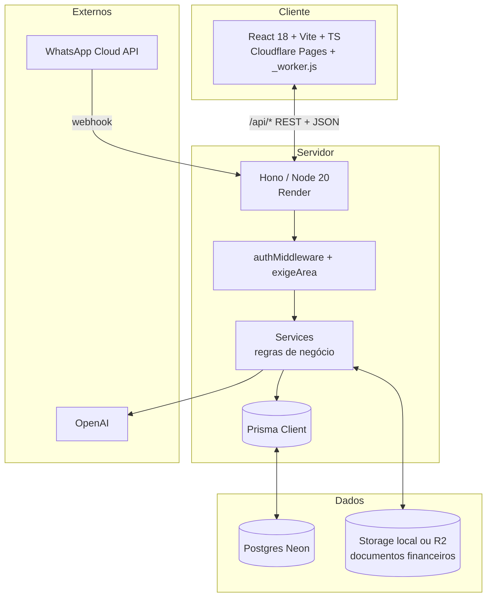
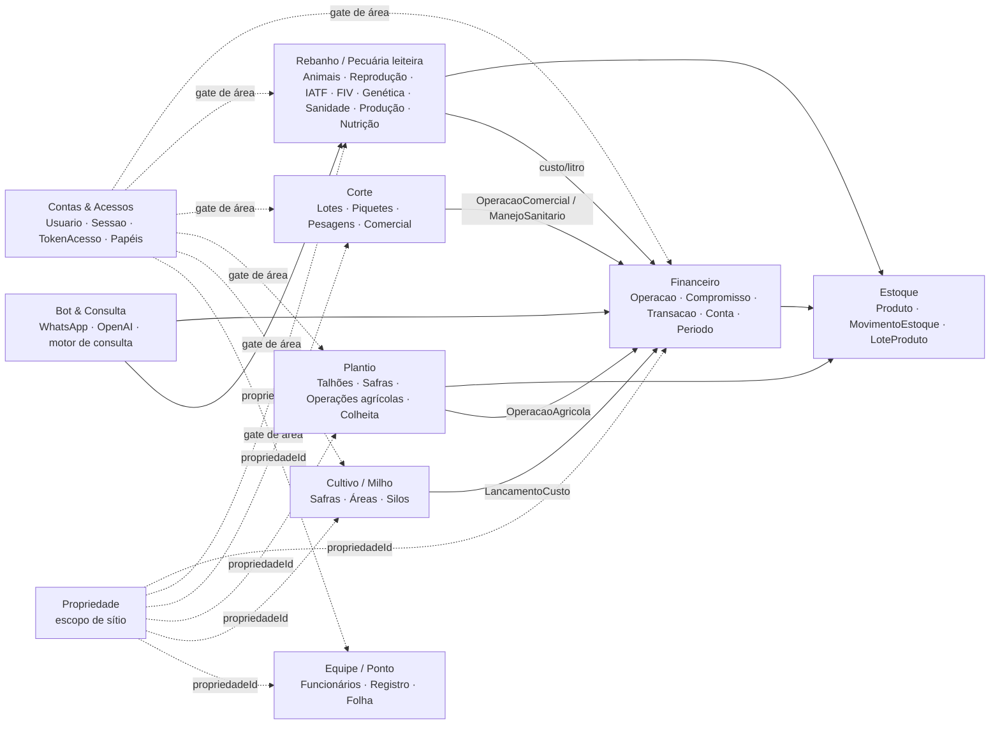
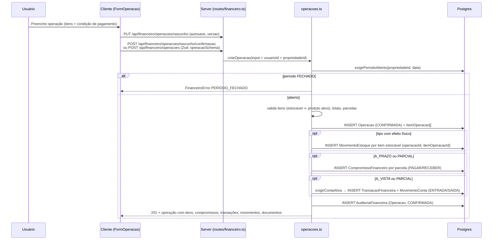
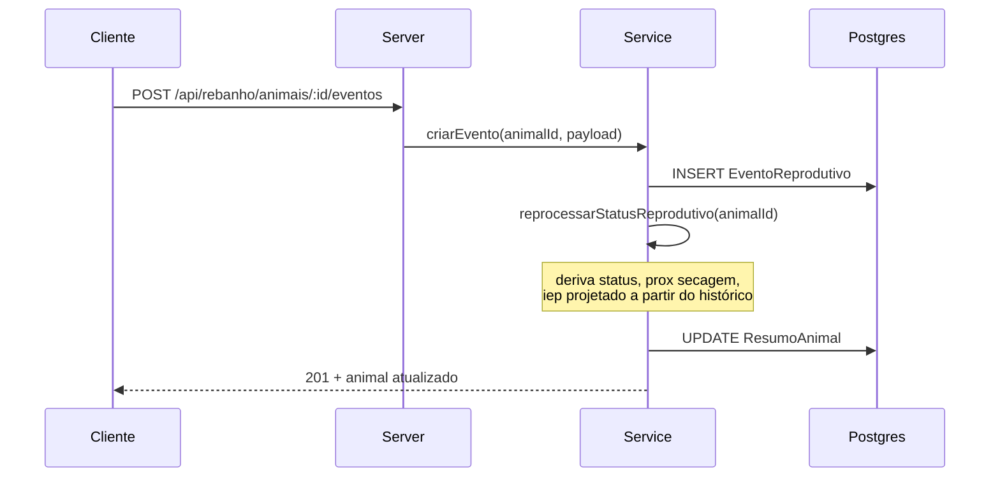

# ARCHITECTURE.md — Arquitetura do Sistema

> **Como o Fazendinha (Terrano) está organizado e por quê.**
> Este documento descreve a arquitetura *atual* e as **convenções obrigatórias** que mantêm o código coerente.
> Em caso de conflito, prevalecem `CLAUDE.md` e `server/prisma/schema.prisma`.

---

## Sumário

1. [Visão de alto nível](#1-visão-de-alto-nível)
2. [Stack e versões](#2-stack-e-versões)
3. [Bounded contexts](#3-bounded-contexts)
4. [Backend (Hono)](#4-backend-hono)
5. [Frontend (React + Vite)](#5-frontend-react--vite)
6. [Banco de dados (Postgres / Neon)](#6-banco-de-dados-postgres--neon)
7. [Fluxos críticos](#7-fluxos-críticos)
8. [Integrações externas](#8-integrações-externas)
9. [Convenções de código](#9-convenções-de-código)
10. [Testes](#10-testes)
11. [Build, deploy e ambientes](#11-build-deploy-e-ambientes)
12. [Escalabilidade e evolução](#12-escalabilidade-e-evolução)

---

## 1. Visão de alto nível



- **Monorepo pnpm**, dois workspaces: `client`, `server`.
- **Servidor stateless** em Hono — a sessão vive no banco (`Sessao`), não em memória; escala horizontal sem sticky session.
- **Banco serverless** Neon (pooled em runtime, direct para migrations/`db push`).
- **Object storage** (disco local em dev, Cloudflare R2 em prod via `lib/storage.ts`) para documentos financeiros (comprovantes, notas).
- **IA externa** (OpenAI) acionada via SDK oficial `openai` — bot do WhatsApp/chat e IAs dos módulos.

---

## 2. Stack e versões

| Camada | Tecnologia | Versão (atual) |
|---|---|---|
| Runtime | Node.js | **20** (suporte nativo `--env-file`) |
| Package manager | pnpm | **10.7.1** (`packageManager` no `package.json`) |
| Backend | Hono | 4.6.x |
| Adapter | `@hono/node-server` | 1.13.x |
| Validação | Zod | 3.24.x |
| Validador HTTP | `@hono/zod-validator` | 0.4.x |
| ORM | Prisma | 6.x |
| Cliente IA | `openai` | 6.x |
| Storage | `@aws-sdk/client-s3` (+ presigner) | 3.x |
| OCR (dormente) | `tesseract.js` + `sharp` + `pdf-parse` | 7.x / 0.34 / 2.x |
| Frontend | React | 18.3.x |
| Build | Vite | 6.x |
| CSS | Tailwind CSS (`@tailwindcss/vite`) | 4.x |
| UI primitives | Radix + `cmdk` + `class-variance-authority` (shadcn-style) | — |
| Tipos | TypeScript | 5.7.x |
| Testes | Vitest | 2.1.x |

ESM em **todos os pacotes** (`"type": "module"`). **Não há** `react-router`, `recharts` nem SDK da Anthropic.

---

## 3. Bounded contexts

A modelagem segue uma divisão em **contextos de domínio**. Cada contexto tem seu próprio conjunto de tipos, regras e fluxos. Cruzar contexto só por contrato explícito (DTOs e IDs).



### Pontes (deliberadas)

- **Financeiro → Estoque:** uma `Operacao` de tipo com efeito físico (`COMPRA_ESTOQUE`, `INVENTARIO_INICIAL`, `BONIFICACAO`, `PRODUCAO`, `DEVOLUCAO`, `AJUSTE_ESTOQUE`, `TRANSFERENCIA_ESTOQUE`, `VENDA` de item estocável) gera `MovimentoEstoque` por `ItemOperacao` estocável, com `operacaoId` + `itemOperacaoId` (ver `services/financeiro/operacoes.ts`). Estoque nunca muda "por fora" sem uma origem justificável (`OrigemMovimentoEstoque`).
- **Módulos operacionais → Financeiro:** fatos operacionais que custam dinheiro (`OperacaoAgricola`, `ManejoSanitario`, `OperacaoComercial`, `LancamentoCusto`) podem apontar para uma `Operacao` (`operacaoId` opcional). O fato operacional continua dono do dado zootécnico/agronômico; o financeiro é dono do valor.
- **Rebanho → Financeiro:** custo de produção (`R$/litro`) em `services/rebanho/custo-producao.ts` soma `TransacaoFinanceira` do centro de custo leiteiro e divide pela produção estimada de `ResumoAnimal`.
- **Sanidade → Estoque:** aplicação de medicamento baixa estoque (`sanidade-estoque.calc.ts`, `MovimentoEstoque` de origem sanitária); dieta baixa insumos (`nutricao.consumo.ts`, `ConsumoPeriodo`).
- **Auth → tudo:** `exigeArea` por prefixo de rota; `Usuario.areas` decide o que o front mostra e o que o server aceita.

### Regra de ouro

> **Mudança em um contexto não pode quebrar outros silenciosamente.** Toda alteração de schema cruzando bounded contexts deve passar por revisão de domínio + ajuste de fluxos. No financeiro, o contrato é [docs/financeiro-rebuild-contrato.md](docs/financeiro-rebuild-contrato.md).

---

## 4. Backend (Hono)

### Estrutura de pastas

```
server/src/
├── index.ts              # bootstrap + middlewares + monta ~80 routers (ordem importa)
├── env.ts                # Zod schema do .env, fail-fast
├── db.ts                 # PrismaClient singleton HMR-safe
├── middleware/
│   ├── auth.ts           # Bearer → Sessao → Usuario (c.set("usuario")); ponte SHARED_ACCESS_TOKEN
│   └── permissao.ts      # getUsuario(c), exigeArea(area), exigePermissao(flag)
├── lib/
│   ├── storage.ts        # driver local (links assinados) ou R2 (S3-compatible)
│   └── ocr.ts            # Tesseract — dormente, sem rota ligada
├── scripts/allowlist.ts  # CLI da allowlist do WhatsApp
├── routes/               # roteamento Hono por domínio — rotas FINAS
│   ├── health.ts · auth.ts · usuarios.ts · propriedade.ts
│   ├── financeiro.ts · categorias.ts · busca.ts · bot.ts · whatsapp.ts
│   ├── rebanho/          # ~50 routers (animais, eventos, sanidade, iatf, fiv, genética,
│   │                     #   acasalamento, producao, tanque, estoque, custo-*, relatorios, ...)
│   ├── corte/            # lotes, eventos, custo, dashboard, ia
│   ├── plantio/          # talhoes, eventos, colheita, planejamento, estoque, custo, dashboard, ia
│   ├── cultivo/          # safras, areas, custos, producao, silos, dashboard
│   └── ponto/            # index (funcionários + registros), dashboard
└── services/             # regra de negócio — o que é testado
    ├── auth/             # sessao.ts · hash.ts · token.ts · papeis.ts (puro) · usuarios.ts · contas.ts
    ├── financeiro/       # operacoes.ts · contas.ts · parceiros.ts · rascunhos.ts · documentos.ts
    │                     #   dashboard.ts · schemas.ts · regras.ts (FinanceiroError, dinheiro(),
    │                     #   exigirPeriodoAberto, exigirContaAtiva, auditar)
    ├── consulta/         # motor estruturado de consultas da IA (registro por domínio, tradutor, validação)
    ├── bot/              # agent.ts (OpenAI function-calling) · tools.ts · conversa.ts · navegacao.ts
    ├── whatsapp/         # webhook.ts (verify HMAC) · handler.ts · client.ts
    ├── propriedade.ts    # garantirFundacaoPropriedade, resolverEscopoLeitura/Escrita
    ├── rebanho/          # ~150 arquivos: *.ts (I/O) + *.calc.ts / *.recompute.ts / *.agg.ts (puros)
    │                     #   + *.schemas.ts (Zod) + *.mappers.ts (DTO) + ia.*.ts
    ├── corte/ · plantio/ · cultivo/ · ponto/   # mesma forma
    ├── busca.ts · volumes.ts · simulacao.calc.ts
    └── ...
```

### Padrões obrigatórios

1. **Chained routes Hono** para preservar tipagem.

   ```ts
   import { Hono } from "hono";
   export const financeiroRouter = new Hono()
     .get("/financeiro/operacoes", listar)
     .post("/financeiro/operacoes", criar)
     .post("/financeiro/operacoes/:id/estorno", estornar);
   ```

2. **Validação com `zValidator`** em payload e query.

   ```ts
   import { zValidator } from "@hono/zod-validator";
   import { criarAnimalSchema } from "../../services/rebanho/animais.schemas.js";

   router.post("/", zValidator("json", criarAnimalSchema), async (c) => {
     const body = c.req.valid("json"); // tipado e validado
     const animal = await animaisService.criar(body);
     return c.json(animal, 201);
   });
   ```

3. **Imports relativos com extensão `.js`** (Node ESM exige).
   ```ts
   import { env } from "./env.js";
   ```

4. **Erro padronizado** em JSON. No financeiro, `FinanceiroError(code, message)` com códigos `NAO_ENCONTRADO | VALIDACAO | PERIODO_FECHADO | SALDO_INSUFICIENTE | JA_REVERTIDO | CONFLITO`; a rota traduz para status HTTP. Nunca deixar erro nu vazar.

5. **Cálculos puros** ficam em `services/.../*.calc.ts`, `*.recompute.ts`, `*.agg.ts`. Testáveis sem banco. **Sem `import prisma`** nesses arquivos.

6. **Funções de aggregate/orchestration** em `services/.../*.ts` (sem `.calc`). Podem usar Prisma, mas devem **chamar funções puras** para qualquer matemática.

7. **Escopo de propriedade** em toda rota de fato: `resolverEscopoLeitura(c)` / `resolverEscopoEscrita(c)` (header `X-Propriedade-Id`). Cadastros de referência são compartilhados.

8. **Escrita financeira** sempre em `prisma.$transaction`, com `exigirPeriodoAberto`, `auditar(...)` e **estorno em vez de delete** (ver seção 7).

### Singleton de Prisma

```ts
// db.ts
const globalForPrisma = globalThis as unknown as { prisma?: PrismaClient };
export const prisma = globalForPrisma.prisma ?? new PrismaClient();
if (process.env.NODE_ENV !== "production") globalForPrisma.prisma = prisma;
```

### Configuração do app (ordem importa)

```ts
// index.ts (resumido)
const app = new Hono();
app.use("*", logger());
app.use("/api/*", cors({ origin: corsOrigins ?? "*" }));

// 1. Isentos de sessão — montados ANTES do gate
app.route("/api", healthRouter);
app.route("/api", whatsappRouter);      // valida X-Hub-Signature-256 por conta própria
app.route("/api", authPublicoRouter);   // login / convite / reset

// 2. Autenticação (Bearer → Sessao → Usuario)
app.use("/api/*", authMiddleware);

// 3. Autorização por área (prefixo)
app.use("/api/rebanho/*", exigeArea("pecuaria"));
app.use("/api/corte/*", exigeArea("pecuaria"));
app.use("/api/plantio/*", exigeArea("agricultura"));
app.use("/api/cultivo/*", exigeArea("agricultura"));
app.use("/api/ponto/*", exigeArea("equipe"));
app.use("/api/financeiro/*", exigeArea("financeiro")); // + /api/categorias*

// 4. Routers protegidos
app.route("/api", authPrivadoRouter); app.route("/api", usuariosRouter); ...

serve({ fetch: app.fetch, port: env.PORT });

// Boot idempotente (à prova de `db push`, que não roda backfill de migration)
garantirFundacaoPropriedade();
garantirResultadosGinecologicosSemente();
garantirDonoBootstrap(); // cria o dono PENDENTE se Usuario vazio + AUTH_BOOTSTRAP_EMAIL
```

### Auth e permissões

- **Modelos:** `Usuario` (`papel`, `abas[]`, `areas[]`, `flags[]`, `status PENDENTE|ATIVO|INATIVO`, `dono`, `senhaHash`), `Sessao` (hash do token, expiração sliding de `AUTH_SESSAO_DIAS`), `TokenAcesso` (CONVITE / RESET, hash + expiração).
- **Fluxo:** `POST /api/auth/login` → `criarSessao` → token bruto ao cliente; cada request envia `Authorization: Bearer <token>`; `authMiddleware` chama `resolverSessao` e injeta `UsuarioContexto` em `c.set("usuario")`. `GET /auth/me`, `POST /auth/logout` protegidos. Convite/reset: `GET /auth/convite/:token`, `POST /auth/convite/aceitar`, `POST /auth/senha/redefinir` (públicos). CRUD de contas em `/api/usuarios/*` (só dono / flag `gerenciarAcessos`).
- **Autorização em duas camadas:** área (`exigeArea` por prefixo em `index.ts`; áreas `financeiro | pecuaria | agricultura | equipe`) e flag (`exigePermissao`: `verValores`, `verInvestimento`, `verSalarios`, `lancar`, `exportar`, `gerenciarAcessos`). Presets por papel (`proprietario`, `secretaria`, `contador`, `gestor`, `consulta`) em `services/auth/papeis.ts` — puro e testado; o front (`client/src/data/acessos.ts`, `lib/areas.ts`) espelha a mesma tabela, mas **o gate real é o servidor**.
- **Ponte de transição:** `SHARED_ACCESS_TOKEN`, se setado, vale como dono sintético (`id: 0`). Sem ele e com a tabela `Usuario` vazia, a porta fica aberta (dev local). Não construir feature nova em cima da ponte.

---

## 5. Frontend (React + Vite)

### Estrutura de pastas

```
client/src/
├── main.tsx              # entry: importa estilos na ordem certa, ToastProvider, monta App
├── App.tsx               # roteamento por useState<Tab> + gate de login + deep-link /convite|/senha
├── router.ts             # ponte Tab ⇄ pathname (deep-link, reload, back/forward)
├── api.ts                # cliente HTTP legado (relatório/cockpit)
├── api/auth.ts           # /api/auth/* (login, logout, me, convite, reset)
├── propriedadeScope.ts   # sítio ativo + comPropriedade(headers) — envelope de TODA request
├── lib/                  # auth.ts (token/usuário em localStorage) · areas.ts · hoje.ts
│                         #   searchIndex.ts · reconciliacao.ts · utils.ts (cn)
├── components/           # UI compartilhada
│   ├── Shell.tsx         # Masthead, ReportHeader, tipo Tab (fonte de verdade das abas)
│   ├── AppSidebar.tsx · Header.tsx · CommandPalette.tsx (⌘K) · FarmPicker.tsx
│   ├── Login.tsx · DefinirSenha.tsx · Acessos.tsx · ConfiguracoesHub.tsx · PlanoContas.tsx
│   ├── IA.tsx · ChatWidget.tsx · Simulador.tsx · Vigilancia.tsx · CenariosReais.tsx
│   ├── charts.tsx        # SVG inline + formatadores (fmt, fmtBR, fmtMoney, fmtMoneyExact, fmtBRL)
│   ├── ActivityPill.tsx · Kpi.tsx · EmptyState.tsx · Loading.tsx · Toast.tsx
│   ├── ConfirmDialog.tsx · PromptDialog.tsx · DateRangePicker.tsx · MonthRangePicker.tsx
│   ├── ui/               # primitivas shadcn-style (button, dialog, dropdown-menu, popover,
│   │                     #   select, sheet, command, input, label, textarea)
│   ├── rb/               # primitivas do rebanho (RebButton, RebField, RebModal, RebTable, RebKpiStrip)
│   └── report/           # primitivas de relatório impresso
├── financeiro/           # módulo financeiro (novo)
│   ├── FinanceiroContent.tsx     # entrypoint: roteia as abas
│   ├── VisaoGeralFinanceira.tsx · OperacoesFinanceiras.tsx · FormOperacao.tsx
│   ├── OperacaoFinanceiraDetalhe.tsx · CompromissosFinanceiros.tsx · ContasFinanceiras.tsx
│   ├── ConfiguracoesFinanceiras.tsx · RelatoriosFinanceiros.tsx · financeiro-ui.tsx
│   ├── novo-api.ts               # fetch tipado de /api/financeiro/* (tipos = contrato da API)
│   └── HOJE.ts
├── rebanho/ · corte/ · plantio/ · cultivo/ · equipe/   # módulos operacionais, mesma forma:
│   ├── <Modulo>Content.tsx (corte: PlantelContent.tsx)
│   ├── api.ts · types.ts · HOJE.ts · nav.ts · domains.tsx
│   ├── components/ · lib/ (derivações puras + testes) · mock/ (referência de forma)
│   └── styles/ (rebanho)
├── data/                 # mocks e planilha de referência (rionovo.ts, projecao.ts, acessos.ts, ...)
└── styles/
    ├── theme.css         # Tailwind v4 (@import "tailwindcss") + tokens — PRIMEIRO
    ├── base.css          # paleta, tipografia, componentes compartilhados (define as variáveis CSS)
    ├── dashboard.css · dashboard-v2.css · cockpit.css · forms.css · acessos.css · terrano-intro.css
    └── typescale.css     # CARREGADO POR ÚLTIMO (legibilidade)
```

### Roteamento

Não usamos `react-router`. O `App.tsx` mantém `useState<Tab>` e `router.ts` sincroniza com a URL (`pushState`/`popstate`), o que dá deep-link, reload e back/forward sem lib. Mapa atual:

| Tab | Path |
|---|---|
| `dashboard` (visão geral) | `/financeiro` |
| `lancar` (operações) | `/financeiro/operacoes` |
| `gastos` (compromissos) | `/financeiro/compromissos` |
| `caixinha` (contas) | `/financeiro/contas` |
| `cadastros` / `plano` | `/financeiro/configuracoes` / `/financeiro/configuracoes/categorias` |
| `relatorio` | `/financeiro/relatorios` |
| `ia` · `acessos` · `config` | `/ia` · `/acessos` · `/configuracoes` |
| `reb-*` | `/pecuaria/<sub>` |
| `cor-*` | `/pecuaria/lotes/<sub>` (Lotes é subseção da Pecuária) |
| `pla-*` · `mil-*` · `eqp-*` | `/plantio/<sub>` · `/milho/<sub>` · `/equipe/<sub>` |
| auth | `/convite/:token` e `/senha/:token` renderizam `DefinirSenha` mesmo deslogado |

`/rebanho/*` e `/corte/*` são caminhos legados redirecionados. Os ids de `Tab` do financeiro mantêm nomes antigos (`lancar`, `gastos`, `caixinha`) por compatibilidade com `Usuario.abas` persistido.

### Padrões obrigatórios

1. **Imports relativos sem extensão** (Vite resolve). Alias `@` → `client/src` disponível (`vite.config.ts` + `tsconfig`).
2. **CSS via `import` em `main.tsx`** na ordem documentada — `theme.css` primeiro, `typescale.css` por último.
3. **Cor via `var(--token)`** ou classes Tailwind ligadas aos tokens, nunca hex solto.
4. **`comPropriedade(headers)`** em todo fetch: injeta `Authorization` e `X-Propriedade-Id`.
5. **Mock em `<modulo>/mock/` e `data/*`** só como referência de forma enquanto a tela não está plugada.
6. **UI:** primitivas `components/ui/*` (shadcn-style sobre Radix) para o financeiro e telas novas; `components/rb/*` no rebanho. Não introduzir outra lib de componentes (Material, Antd, Chakra).
7. **Formatadores e gráficos** reusados de `components/charts.tsx`.

### Proxy de dev

`vite.config.ts` faz proxy `/api → http://localhost:41873`. Em produção o papel é do `client/public/_worker.js` (Cloudflare Pages) — ver seção 11.

---

## 6. Banco de dados (Postgres / Neon)

### Conexão

- `schema.prisma`: `url = env("DATABASE_URL")` (**pooled**, `-pooler` no host) e `directUrl = env("DIRECT_URL")` (**direct**).
- Runtime e `prisma migrate deploy` usam a pooled. `prisma migrate dev` (shadow DB) e `prisma db push` usam a direct.
- `pnpm dev:server` executa `prisma db push --skip-generate` **antes** de `tsx watch` — o schema local acompanha o código sem migration.

### Modelagem

Schema completo em `server/prisma/schema.prisma` (~120 models, ~65 enums). Resumo dos contextos:

| Contexto | Models principais |
|---|---|
| Financeiro | `Operacao`, `ItemOperacao`, `CompromissoFinanceiro`, `Liquidacao`, `TransacaoFinanceira`, `MovimentoConta`, `ContaFinanceira`, `Parceiro`, `PeriodoFinanceiro`, `RascunhoOperacao`, `DocumentoFinanceiro`, `AuditoriaFinanceira`, `Categoria` ⊂ `GrupoCategoria`, `CentroCusto` |
| Estoque | `Produto`, `ComposicaoProdutoItem`, `LocalArmazenamento`, `LoteProduto`, `MovimentoEstoque`, `ConsumoPeriodo`, `PrincipioAtivo` |
| Propriedade | `Propriedade`, `Configuracao`, `ParametroManejo`, `RegistroChuva` |
| Auth | `Usuario`, `Sessao`, `TokenAcesso` |
| Rebanho | `Animal`, `ResumoAnimal`, `Raca`, `Grupo`, `Lactacao`, `Pesagem`, `MovimentacaoAnimal`, `FiltroAnimal`, `AptidaoAnimal` |
| Reprodução | `EventoReprodutivo`, `ResultadoExameGinecologico`, `ProtocoloIATF` (+ etapas/aplicações), `ProgramacaoIATFLote`, `Coleta`, `OocitoColeta`, `FertilizacaoColeta`, `EmbriaoColeta`, `GrupoPoolDoadora` |
| Genética / acasalamento | `Reprodutor`, `CentralSemen`, `TipoSemen`, `EstoqueSemen`, `IndicadorGenetico`, `MarcadorGenetico`, `Caseina`, `PedigreeReprodutor`, `MedidaAcasalamento`, `PlanoAcasalamento` (+ versões/linhas) |
| Sanidade | `EventoSanitario`, `ExameQuarto`, `VacinaAgendada`, `ProtocoloSanitario` (+ etapas/aplicações) |
| Produção de leite | `ControleLeiteiro`, `ProducaoLote`, `Tanque`, `AnaliseTanque` |
| Nutrição | `Dieta`, `DietaItem` |
| Formulários de campo | `ModeloFormularioCampo`, `FolhaCampo`, `LinhaFolhaCampo` |
| Corte | `LoteCorte`, `ResumoLote`, `Piquete`, `PesagemLote`, `ManejoSanitario`, `Suplementacao`, `OperacaoComercial` |
| Plantio (café) | `Lavoura`, `VariedadeCafe`, `Talhao`, `ResumoTalhao`, `SafraTalhao`, `Safra`, `OperacaoAgricola`, `PlanoAdubacao`, `InspecaoMIP`, `AmostraSolo`, `AmostraFoliar`, `PassadaColheita`, `TarefaAgricola`, `ApontamentoMaquina` |
| Cultivo (milho/grãos) | `SafraCultivo`, `AreaCultivo`, `LancamentoCusto`, `ProducaoCultivo`, `Silo`, `MovimentoSilo`, `ResumoSafraCultivo` |
| Equipe / ponto | `Funcionario`, `RegistroPonto` |
| WhatsApp | `UsuarioWhatsapp`, `ConversaWhatsapp`, `MensagemWhatsapp` |

O modelo financeiro legado (`Lancamento`, `FechamentoMensal`, `ContaBancaria`, `ClienteFornecedor`, `Caixinha`, `NotaFiscal*`, `WhatsAppConfirmacaoPendente`) **não existe mais**.

### Núcleo financeiro (o que cada model significa)

- `Operacao` — **o fato de negócio** (`tipo: TipoOperacaoFinanceira` = `COMPRA_ESTOQUE | COMPRA_CONSUMO_DIRETO | SERVICO | VENDA | APORTE | RETIRADA | TRANSFERENCIA_FINANCEIRA | AJUSTE_ESTOQUE | TRANSFERENCIA_ESTOQUE | INVENTARIO_INICIAL | BONIFICACAO | DEVOLUCAO | PRODUCAO`; `status RASCUNHO | CONFIRMADA | CANCELADA`; `data @db.Date`; `valorTotal`; `propriedadeId` **obrigatório**; `parceiroId?`, `categoriaId?`, `centroCustoId?`; `corrigeOperacaoId?` liga uma correção à operação cancelada; `criadoPorId?`). Filhos: `ItemOperacao[]`.
- `CompromissoFinanceiro` — **valor ainda pendente** (`tipo PAGAR | RECEBER`, `valorOriginal`, `dataVencimento`, `numeroParcela/totalParcelas`, `status PENDENTE | PARCIAL | LIQUIDADO | CANCELADO`). **Não altera saldo.** `Liquidacao` liga compromisso ↔ transação com o valor liquidado.
- `TransacaoFinanceira` — **dinheiro realizado** (`tipo PAGAMENTO | RECEBIMENTO | TRANSFERENCIA | APORTE | RETIRADA | AJUSTE | REVERSAO`, `valorTotal`, `formaPagamento`, `status CONFIRMADA | REVERTIDA`). Cada transação tem `MovimentoConta[]` (`direcao ENTRADA | SAIDA`, `contaId`, `valor`) — **única fonte de alteração de saldo** de uma `ContaFinanceira` (`BANCO | CAIXA | APLICACAO | DINHEIRO`, `saldoAbertura`, `incluirNoSaldoGeral`, `ativo`).
- `MovimentoEstoque` — **efeito físico** (`tipo ENTRADA | SAIDA | AJUSTE`, `origem: OrigemMovimentoEstoque` = `COMPRA | CONSUMO_DIRETO | TRANSFERENCIA | PRODUCAO | DEVOLUCAO | BONIFICACAO | INVENTARIO_INICIAL | NUTRICAO | SANIDADE | PERDA | AJUSTE_INVENTARIO`, `status CONFIRMADO | REVERTIDO`, `operacaoId?`, `itemOperacaoId?`, `consumoPeriodoId?`, `revertidoPor`).
- `RascunhoOperacao` — um por `(propriedadeId, criadoPorId)`, `dados Json` + `versao` (concorrência otimista); sem efeito contábil até `confirmarRascunho`.
- `DocumentoFinanceiro` — comprovante/nota anexado a operação, transação, compromisso ou rascunho (`storageDriver`, `bucket`, `storageKey`, `sha256`, `mimeType`, `tamanhoBytes`).
- `PeriodoFinanceiro` — `(propriedadeId, ano, mes)` `ABERTO | FECHADO`, `fechadoEm`, `fechadoPorId`.
- `AuditoriaFinanceira` — `entidade`, `entidadeId`, `acao`, `motivo`, `usuarioId`, `estadoAnterior`/`estadoPosterior` (Json).

### Regras de schema

- **Decimal financeiro:** `@db.Decimal(14, 2)` (quantidades `(12, 3)`, valor unitário `(14, 4)`). Nunca `Float`. Em código, sempre `Prisma.Decimal` (`dinheiro()` em `regras.ts`).
- **Decimal de produção/peso:** `@db.Decimal(6, 2)` ou `@db.Decimal(7, 2)`.
- **Datas-só-data:** `@db.Date` (sem hora).
- **Valor sempre positivo.** O sinal vem de `DirecaoMovimentoConta` / tipo da transação.
- **Nada confirmado é apagado:** estorno com evento inverso + `AuditoriaFinanceira`. `MovimentoEstoque` vira `REVERTIDO` com `revertidoPor`.
- **`propriedadeId`** obrigatório no financeiro novo; nullable (com backfill no boot) nos módulos antigos.
- **Cascade** só quando faz sentido de domínio (`Animal → ResumoAnimal`, `RascunhoOperacao → DocumentoFinanceiro`).
- **Unique composto** quando aplicável (`Categoria(grupoCategoriaId, nome)`, `PeriodoFinanceiro(propriedadeId, ano, mes)`, `RascunhoOperacao(propriedadeId, criadoPorId)`).
- **Índices** em todos os filtros frequentes (`Operacao(propriedadeId, data)`, `MovimentoEstoque(operacaoId)`, `Animal(status)`, `EventoReprodutivo(animalId, data)`).

### Migrations e sync de schema

- Diretório: `server/prisma/migrations/` — **45 migrations**, nome `AAAAMMDDHHMMSS_descricao_curta`.
- **Sempre revisar SQL gerado** antes de commitar. Backfill de dados pode viver na migration, mas **também precisa ser idempotente no boot** (`garantirFundacaoPropriedade`, `garantirDonoBootstrap`), porque `db push` não executa migrations.
- Dev: `pnpm dev:server` faz `db push`. Migration nova: `pnpm prisma:migrate` com `DIRECT_URL` no `.env`.
- Prod (Render): `start:prod` é só `node dist/index.js`; o schema é sincronizado por deploy controlado (`migrate deploy` ou `db push`), ver `DEPLOY.md`. Nem toda tabela tem `CREATE TABLE` em migration — `migrate deploy` do zero pode quebrar; recuperar com `migrate resolve --rolled-back <migration> && db push` (seção 9 de [docs/design/multi-propriedade.md](docs/design/multi-propriedade.md)).

### Período financeiro (fechamento)

`PeriodoFinanceiro(propriedadeId, ano, mes)` substitui o antigo `FechamentoMensal`. Toda mutação financeira passa por:

```ts
// services/financeiro/regras.ts
export async function exigirPeriodoAberto(db, propriedadeId: number, data: Date) {
  const periodo = await db.periodoFinanceiro.findUnique({
    where: { propriedadeId_ano_mes: { propriedadeId, ano: data.getUTCFullYear(), mes: data.getUTCMonth() + 1 } },
  });
  if (periodo?.status === "FECHADO") throw new FinanceiroError("PERIODO_FECHADO", "...");
}
```

Aplicado em criação de operação, transação avulsa, transferência, liquidação **e** estorno (o estorno checa o mês corrente). Ausência de linha = período aberto. Hoje só existe a checagem; a rota de fechar/reabrir período ainda não foi exposta na API.

---

## 7. Fluxos críticos

### 7.1 Operação financeira (compra, venda, serviço)

Tudo acontece em `criarOperacaoTx` (`services/financeiro/operacoes.ts`), dentro de um único `prisma.$transaction`:



Invariantes (do contrato): compra à vista **não** cria compromisso; pagamento parcial cria transação pelo pago e compromisso só pelo restante; compromisso **nunca** altera saldo; `MovimentoConta` é a única coisa que altera saldo.

### 7.2 Liquidação, transferência e estorno

- **Liquidar compromisso** — `POST /financeiro/compromissos/:id/liquidacoes` → `liquidarCompromisso`: valida que o valor ≤ saldo pendente (`SALDO_INSUFICIENTE`), cria `TransacaoFinanceira` + `MovimentoConta`, cria `Liquidacao`, atualiza `status` do compromisso (`PARCIAL`/`LIQUIDADO`), audita.
- **Transferência entre contas** — `POST /financeiro/transferencias` → `transferir`: duas pontas de mesmo valor (SAIDA na origem, ENTRADA no destino); impacto zero no saldo geral. Aporte na caixinha é uma transferência para conta `CAIXA`.
- **Transação avulsa** — `POST /financeiro/transacoes` (aporte/retirada/pagamento sem operação).
- **Estorno** — `POST /financeiro/operacoes/:id/estorno` e `POST /financeiro/transacoes/:id/estorno`: nunca `DELETE`. Operação: cria movimentos de estoque inversos (marca originais `REVERTIDO`), cancela compromissos, estorna transações, `status = CANCELADA`, audita com `motivo`. Uma operação cancelada pode receber uma **correção** (`corrigeOperacaoId`).

### 7.3 Documentos e WhatsApp

- **Documento financeiro** — `POST /financeiro/operacoes/:id/documentos` (ou no rascunho) recebe `multipart/form-data`; `documentos.ts` grava via `lib/storage.ts` (local com link assinado por `LOCAL_DOWNLOAD_SECRET`, ou R2) e cria `DocumentoFinanceiro` com `sha256`. Download em `GET /financeiro/documentos/:id/download`. **Não há OCR nem extração automática** — `lib/ocr.ts` está no repo mas sem rota.
- **WhatsApp** — `routes/whatsapp.ts` valida `X-Hub-Signature-256` (`services/whatsapp/verify.ts`), `handler.ts` checa a allowlist (`UsuarioWhatsapp`), carrega histórico (`ConversaWhatsapp`/`MensagemWhatsapp`) e chama `bot/agent.ts`: loop de function-calling da OpenAI cujas tools (`bot/tools.ts`, ex.: `saldo_contas`, `estoque`, consultas do motor `services/consulta/`) leem o banco por código estruturado — **o LLM não gera SQL**. O mesmo agente atende o chat web em `routes/bot.ts`.

### 7.4 Registro de evento reprodutivo



### 7.5 Cálculo de custo/litro

`/api/rebanho/custo-producao?meses=12` (`services/rebanho/custo-producao.ts`):

1. Soma `TransacaoFinanceira` (`status CONFIRMADA`, `tipo PAGAMENTO`, `data ≥ desde`) cuja `Operacao` tem `CentroCusto` "Atividade Leiteira".
2. Quebra por categoria (função pura).
3. Estima `litrosPeriodo = Σ ResumoAnimal.producaoMediaDia × dias`.
4. `custoLitro = custeioTotal ÷ litrosPeriodo`.
5. Calcula `custoVacaDia` via `estoque.calc.ts`.

Orquestração faz I/O; `*.calc.ts` faz aritmética e é testado sem banco.

---

## 8. Integrações externas

### 8.1 OpenAI

- **SDK:** `openai` (Chat Completions com function-calling).
- **Variáveis:** `OPENAI_API_KEY` (sem ela: bot/chat respondem 503 e as IAs dos módulos caem em modo demonstração com regras locais) e `OPENAI_MODEL` (default `gpt-4o`).
- **Uso atual:**
  1. Bot do WhatsApp e chat web (`services/bot/agent.ts` + `tools.ts` + `navegacao.ts` para deep-links).
  2. IA por módulo — rebanho (`services/rebanho/ia.*.ts`), corte, plantio (`ia.context.ts` monta contexto, `ia.llm.ts` chama o modelo, `ia.responder.ts` formata; `ia.insights.ts` são regras locais).
  3. Bateria de avaliação de respostas (`scripts/bateria-ia.*`).
- Nenhuma consulta é SQL gerado pelo LLM — o motor estruturado (`services/consulta/`) valida e executa.

### 8.2 WhatsApp Cloud API (Meta)

- Webhook em `/api/whatsapp` (montado antes do `authMiddleware`; valida HMAC com `WHATSAPP_APP_SECRET` e o `GET` de verificação com `WHATSAPP_VERIFY_TOKEN`).
- Envio via `services/whatsapp/client.ts` (`WHATSAPP_ACCESS_TOKEN`, `WHATSAPP_PHONE_NUMBER_ID`).
- Allowlist em `UsuarioWhatsapp` (CLI `whatsapp:user`); histórico em `ConversaWhatsapp`/`MensagemWhatsapp`.

### 8.3 Object Storage

- **Driver** por `STORAGE_DRIVER`: `local` (`LOCAL_STORAGE_DIR`, links assinados com `LOCAL_DOWNLOAD_SECRET`) ou `r2` (Cloudflare R2 via `@aws-sdk/client-s3`, exige `R2_*`).
- `DocumentoFinanceiro.storageDriver/bucket/storageKey/sha256` registram onde e o quê. Sempre gravar `sha256`.

### 8.4 Neon

- Postgres serverless; pooled em runtime, direct para `migrate dev`/`db push`.
- Branching de banco por feature é possível, mas o fluxo padrão é um banco local (`fazendinha_local`) em dev.

### 8.5 Cloudflare Pages + Render

- Pages serve `client/dist/`; `client/public/_worker.js` faz proxy de `/api/*` para `API_ORIGIN` (Render) repassando `Authorization`, e `_redirects` faz o fallback SPA.
- Render (`render.yaml`, serviço `terrano-api`) roda o server com health check em `/api/health`.

---

## 9. Convenções de código

### Linguagem

- **Identificadores em PT-BR** consistentes com o schema (`Operacao`, `CompromissoFinanceiro`, `Animal`, `dataVencimento`). Não traduzir para inglês.
- **Comentários em PT-BR**, curtos, **só quando explicam o porquê**.
- **Mensagens de erro em PT-BR** com vocabulário do produtor.

### TypeScript

- `strict: true`.
- Tipos canônicos: backend em `services/<modulo>/types.ts` / `*.schemas.ts` (Zod infere); frontend em `<modulo>/types.ts` e `financeiro/novo-api.ts`.
- **Sem `any`** salvo em fronteiras explícitas (mock `R` em `data/rionovo.ts`, `dados Json` do rascunho).
- **Sem `as` casts** sem comentário justificando.

### Imports

- Backend: imports relativos com `.js` (`./env.js`).
- Frontend: imports relativos sem extensão; alias `@/` disponível para `client/src`.

### Estilo de PR

- Commits em PT-BR: `feat(modulo): descrição`, `fix(modulo): descrição`, `chore(infra): ...`.
- Escopos usuais: `financeiro`, `rebanho`, `corte`, `plantio`, `cultivo`, `ponto`, `auth`, `sidebar`, `ui`, `db`, `infra`.

---

## 10. Testes

- **Vitest** nos dois workspaces (`server/vitest.config.ts`, `client`), arquivos `*.test.ts(x)` ao lado do código — ~155 no server, ~60 no client.
- **Server:** cobertura focada em funções puras (`*.calc.ts`, `*.recompute.ts`, `*.agg.ts`), schemas Zod (`schemas.test.ts`), regras de auth (`papeis`, `hash`, `token`), rascunhos do financeiro, serialização/tools do bot, verificação do webhook. Não conectam ao banco, mas importam `env.ts` — sem `server/.env`, exporte `DATABASE_URL` dummy (o CI faz isso).
- **Client:** `lib/` (areas, searchIndex, reconciliacao), `router.ts`, `components/ui/*`, `components/rb/*`, fluxos do financeiro (`FormOperacao`, `OperacoesFinanceiras`, `CompromissosFinanceiros`, `responsivo`), smoke tests de render em `__smoke__/`.

### Padrão de teste puro

```ts
// services/rebanho/estoque.calc.test.ts
import { describe, it, expect } from "vitest";
import { custoVacaDia } from "./estoque.calc.js";

describe("custoVacaDia", () => {
  it("retorna null sem dados", () => {
    expect(custoVacaDia([], 30, new Date(), 30)).toBeNull();
  });
});
```

### O que NÃO testar

- Camada HTTP (rotas) — Hono já testa via tipos + Zod (exceções pontuais em `routes/rebanho/*.test.ts` para montagem de query).
- Prisma queries triviais (CRUD direto).
- UI sem regressão visual relevante.

---

## 11. Build, deploy e ambientes

### Dev local

```bash
pnpm install                         # postinstall do server roda prisma generate
cp server/.env.example server/.env   # DATABASE_URL (+ DIRECT_URL)
pnpm dev                             # server: prisma db push + tsx watch (:41873) · client: vite (:41875)
```

### Build

```bash
pnpm build        # ambos os workspaces
```

- Server: `tsc -p tsconfig.json` → `server/dist/`.
- Client: `vite build` → `client/dist/` (inclui `public/_worker.js` e `_redirects`).

### CI

`.github/workflows/staging.yml` (push/PR na `main`): `pnpm install --frozen-lockfile` → `prisma generate` → `pnpm -r run build` → testes do server (com `DATABASE_URL` dummy). Não faz deploy.

### Produção

- **API:** Render, serviço `terrano-api` (`render.yaml`): build `pnpm install && prisma generate && build`, start `pnpm --filter rionovo-server run start:prod` (= `node dist/index.js`), health check `/api/health`, auto-deploy da `main` quando os checks passam. Sync de schema é passo separado (ver seção 6).
- **Client:** Cloudflare Pages via integração Git; `_worker.js` faz proxy `/api/*` → `API_ORIGIN` (variável do Pages).
- **Banco:** Neon.

Detalhe operacional em `DEPLOY.md`.

### Variáveis de ambiente (`server/src/env.ts`)

| Variável | Obrigatória | Uso |
|---|---|---|
| `DATABASE_URL` | **sim** | Pooled Neon URL |
| `DIRECT_URL` | para `migrate dev` / `db push` | Direct Neon URL (`directUrl` no schema) |
| `PORT` | não (default 41873) | Porta do server |
| `NODE_ENV` | não (default `development`) | `development\|production\|test` |
| `JWT_SECRET` | não | reservado (default de dev) |
| `CORS_ORIGIN` | recomendada em prod | CSV de origens; vazio = tudo (boot avisa em prod) |
| `SHARED_ACCESS_TOKEN` | não | Ponte: vale como dono (≥16 chars) |
| `AUTH_BOOTSTRAP_EMAIL` / `AUTH_BOOTSTRAP_NOME` | não | Cria o dono PENDENTE no 1º boot com `Usuario` vazio |
| `APP_BASE_URL` | não | Prefixo dos links de convite/reset |
| `AUTH_SESSAO_DIAS` | não (default 30) | Validade sliding da sessão |
| `OPENAI_API_KEY` / `OPENAI_MODEL` | não | IA; sem chave = bot 503 + IA demo; model default `gpt-4o` |
| `WHATSAPP_VERIFY_TOKEN` / `ACCESS_TOKEN` / `PHONE_NUMBER_ID` / `APP_SECRET` | não (todos p/ webhook) | Meta Cloud API |
| `STORAGE_DRIVER` | não (default `local`) | `local` \| `r2` |
| `LOCAL_STORAGE_DIR` / `LOCAL_DOWNLOAD_SECRET` | não | Storage local + assinatura de download |
| `R2_ACCOUNT_ID` / `R2_ACCESS_KEY_ID` / `R2_SECRET_ACCESS_KEY` / `R2_BUCKET_NOTAS` | se `r2` | Cloudflare R2 (`superRefine`) |
| `DASHBOARD_MESES_QUEIMA` | não (default 6) | Média de queima mensal |

`env.ts` valida via Zod e **falha rápido** (`process.exit(1)`) se inválido. **Sempre importar de `env.ts`**, nunca `process.env`. Client: `VITE_HOJE_ISO` fixa a data "hoje" em builds de demo.

---

## 12. Escalabilidade e evolução

### Hoje

- 1 fazenda (Rio Novo) com multi-propriedade implementado (vários sítios sob a mesma conta), rebanho ativo e financeiro novo com seed pequeno — sem importador do histórico Excel para o modelo novo.
- Auth real (usuários, sessões, papéis, áreas, flags) em produção; `SHARED_ACCESS_TOKEN` só como ponte.
- Sem cache; latência aceitável em endpoints agregados.

### Quando escalar

1. **Cache em memória** com TTL para agregados de dashboard (períodos `FECHADO` são imutáveis — cache longo).
2. **Materialização:** `ResumoAnimal`, `ResumoLote`, `ResumoTalhao`, `ResumoSafraCultivo` já existem; estender para um `ResumoFazenda` (KPIs da visão geral).
3. **Pre-aggregations** em jobs noturnos (custo/litro consolidado por mês).
4. **Worker queue** (BullMQ ou similar) para OCR de documentos (religar `lib/ocr.ts`), recompute de score e processamento assíncrono do WhatsApp.
5. **Rota de fechamento de período** (`PeriodoFinanceiro` FECHADO/reaberto com auditoria) e **importador** do histórico para `Operacao`/`TransacaoFinanceira`.
6. **Auth:** trocar a ponte `SHARED_ACCESS_TOKEN` por zero; considerar SSO/2FA quando houver mais operadores.

### Mudanças que mudariam a arquitetura

| Demanda | Mudança |
|---|---|
| App mobile nativo | Manter API; criar cliente RN ou Capacitor sobre web. |
| Multi-tenant em escala (várias fazendas independentes) | `Propriedade` já escopa fatos; falta tenant acima dela — particionar Postgres ou usar Neon branches. |
| Sincronização offline | Service Worker + IndexedDB; sync com timestamps. |
| Streaming de ordenha (IoT) | Endpoint dedicado em `routes/ingest/`, possivelmente WebSocket. |
| BI cruzando propriedades | DW separado (BigQuery/ClickHouse) alimentado por ETL. |

---

## Referências cruzadas

- [`CLAUDE.md`](./CLAUDE.md) — instruções operacionais resumidas; prevalece sobre este doc em caso de conflito.
- [`docs/financeiro-rebuild-contrato.md`](./docs/financeiro-rebuild-contrato.md) — contrato funcional do financeiro novo.
- [`docs/design/multi-propriedade.md`](./docs/design/multi-propriedade.md) — escopo de sítio, backfill e pegadinhas de deploy.
- [`docs/design/pecuaria-unificada.md`](./docs/design/pecuaria-unificada.md) — por que Corte vive em `/pecuaria/lotes`.
- [`DOMAIN.md`](./DOMAIN.md) — vocabulário que aparece no schema.
- [`COMPONENTS.md`](./COMPONENTS.md) — componentes que consomem a API.
- [`METRICS.md`](./METRICS.md) — fórmulas e como os services calculam.
- [`AI_RULES.md`](./AI_RULES.md) — regras obrigatórias para qualquer agente que mexa no código.
- [`DEPLOY.md`](./DEPLOY.md) — operação de deploy.
- `server/prisma/schema.prisma` — fonte de verdade do banco.
- `server/src/index.ts` — bootstrap.
