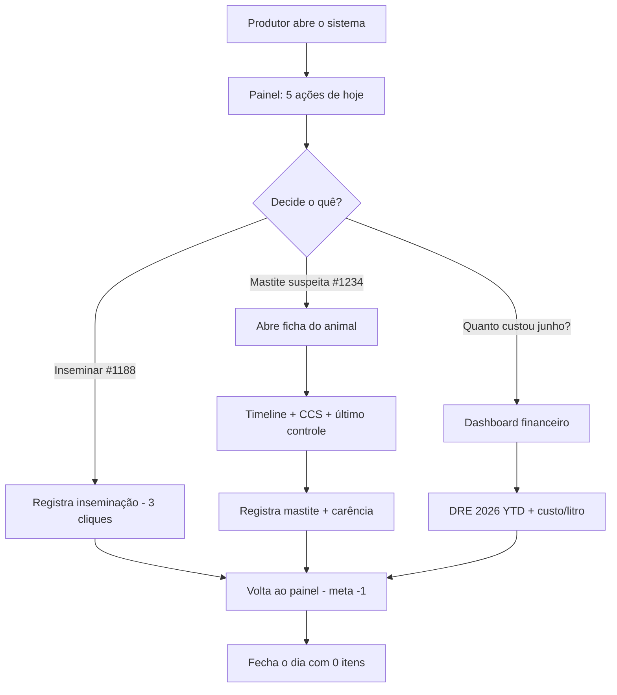

# PRODUCT.md — Missão, Visão e Mentalidade do Produto

> **Este documento não fala de código. Fala do produto.**
> Toda funcionalidade, copy, decisão de UX e priorização deve ser avaliada contra o que está aqui.

---

## 1. Missão

> **Aumentar a lucratividade de propriedades leiteiras através de dados, automação e inteligência.**

Não somos:

- Um software veterinário.
- Um ERP rural.
- Um "Excel mais bonito".
- Um sistema de registro burocrático.

Somos um **co-piloto financeiro e produtivo** para o produtor de leite. Cada tela existe para responder à pergunta:

> *"O que eu devo fazer hoje para ganhar mais dinheiro?"*

Se uma feature não ajuda a responder essa pergunta — direta ou indiretamente — ela não entra.

---

## 2. Visão

Em 5 anos, queremos que o **Fazendinha** seja o sistema operacional padrão de fazendas leiteiras pequenas e médias no Brasil. Que substitua planilhas, cadernetas, sistemas verticais antigos (BPOs, software veterinário, controles de ordenha isolados) e principalmente **a fragmentação de decisão**.

O produtor abre uma tela só. O sistema decide o que mostrar. O resultado é um conjunto **curto e concreto** de ações com impacto financeiro estimado:

- *"Inseminar vaca #1188 hoje — ela está no PEV e cada dia parada custa R$ X."*
- *"Descartar vaca #0942 — produção 24 L/d com CCS 612; lucro projetado negativo no ciclo."*
- *"Trocar fornecedor de ração farelo de soja — preço atual está 14% acima da média de 90 dias."*

A IA tira o produtor do dilúvio de dados. A interface é simples para que ele confie.

---

## 3. Valores

| Valor | O que significa na prática |
|---|---|
| **Verdade financeira** | Nunca esconder prejuízo. Não decorar projeção. Margem real é margem real. |
| **Decisão > Relatório** | Todo painel termina com um "próximo passo" sugerido. |
| **Simples é um trabalho árduo** | Fácil para o produtor exige esforço técnico do time. |
| **Domínio antes de UI** | Quem desenha sem conhecer DEL, CCS ou IEP entrega lixo bonito. |
| **Reuso, sempre** | Componentes, fórmulas, palavras. Inconsistência confunde o produtor. |
| **Memória institucional** | Cada decisão fica registrada (no documento, no commit, na timeline do animal). |

---

## 4. Público-alvo

### Persona principal — Marco Antônio (ou variantes)

| Atributo | Detalhe |
|---|---|
| Idade | 45–70 anos |
| Tecnologia | Notebook, tablet ocasional, WhatsApp diário |
| Escolaridade | Variada — não assumir intimidade com termos técnicos de software |
| Domínio próprio | **Especialista em produção de leite.** Sabe quando uma vaca está "estranha" antes de qualquer sensor avisar. |
| Frustração com sistemas atuais | Telas com muitos campos. Linguagem genérica. Resultados em PDFs que ninguém lê. |
| Comportamento de leitura | Olha rápido. Decide com base no primeiro número grande na tela. |
| Aversão a risco | Alta — prefere errar para menos do que para mais. |
| Disponibilidade | Manhãs apertadas (ordenha). Decisões importantes acontecem entre 9h e 11h, e entre 19h e 21h. |

### Persona secundária — Zootecnista/Veterinário/Gerente

- Trabalha em parceria com o produtor.
- Lê dados em mais detalhe.
- Precisa de **timeline densa** por animal, exportações, filtros.
- Toma decisões técnicas (protocolos, descartes, lotação).

### Persona terciária — BPO contábil

- Hoje produz o relatório no Excel.
- Migrando para o Fazendinha como entrada de dados.
- Precisa de **conciliação confiável** (categorias, centros de custo, fechamentos).

> **Regra:** Quando houver conflito entre as 3 personas, **o produtor vence**. Sempre.

---

## 5. Dores que estamos resolvendo

### Financeiras

1. *"Tenho 3 anos de planilha e não sei quanto custa um litro de leite na minha fazenda."*
2. *"Pago BPO, mas leio o relatório só no fim do mês — quando já é tarde."*
3. *"Misturo aquisição de animal com custeio e o resultado fica errado."*
4. *"Não sei se preciso vender vaca pra fechar o caixa de junho."*

### Produtivas / zootécnicas

5. *"Tenho 130 vacas e não sei quais inseminar hoje."*
6. *"O CCS de algumas tá subindo e eu só percebo quando vira mastite clínica."*
7. *"Vaca X gerou 4 lactações e nunca olhei o histórico individual dela."*
8. *"Lote do Holandês come mais ração que o do Girolando — não sei se compensa."*

### Decisórias

9. *"Tenho cem indicadores no IDEagri/relatório — qual é o que importa hoje?"*
10. *"Ouço o vendedor de ração, o veterinário, o consultor, o vizinho. Quem tem razão?"*

---

## 6. Proposta de Valor

| Vetor | Como o Fazendinha entrega |
|---|---|
| **Lucratividade visível** | Custo/litro e custo/vaca-dia atualizados em tempo real, ligados aos lançamentos reais. |
| **Decisões diárias claras** | Worklists curtas: "a inseminar", "DG pendente", "a secar", "CCS subindo", "partos ≤ 30d". |
| **Memória do animal** | Timeline por vaca: parto, mastite, IATF, controle, secagem — toda história em uma página. |
| **Automação** | Nota fiscal entra por WhatsApp e o Claude extrai os campos. Produtor confirma com 1 toque. |
| **Inteligência aplicada** | Score 0–100 por animal, percentil no rebanho, projeção de lucro até o fim da lactação. |
| **Verdade contábil** | Regime de caixa, fechamento mensal lockável, conciliação por centro de custo. |
| **Tela única** | Painel "Hoje" — um resumo executivo de tudo que precisa de atenção, sem o produtor caçar. |

---

## 7. Fluxo do usuário (jornada-mãe)

Cada interação tem que terminar com **uma ação concluída** ou **uma decisão tomada**, não com um relatório aberto.

---

## 8. Mentalidade do produto

### 8.1. Pergunta de negócio primeiro

Antes de qualquer tela:

> *"Que pergunta de negócio essa tela responde?"*

Se a resposta for "ver os dados", a tela não existe ainda. Refine até virar:

- "Quais vacas eu preciso inseminar hoje?"
- "Estou ganhando ou perdendo dinheiro com a vaca #1234?"
- "Qual categoria de despesa subiu mais este ano?"

### 8.2. Número grande primeiro, detalhe depois

O produtor olha 1,5 segundo. Se o KPI principal está claro, ele decide. Se está confuso, ele fecha.

| Ordem visual | Conteúdo |
|---|---|
| 1º | Número grande, em serif, no topo do card. |
| 2º | Delta (subiu/desceu, comparação com meta). |
| 3º | Contexto (período, fonte). |
| 4º | Drill-down (só se for útil). |

### 8.3. Linguagem do produtor

| Não dizer | Dizer |
|---|---|
| "Submeter formulário" | "Salvar" |
| "Entidade Animal" | "Vaca", "novilha", "bezerra" — o que faz sentido |
| "CRUD de lançamentos" | "Lançar entrada e saída" |
| "Status reprodutivo: PEV" | "Apta a inseminar" |
| "Coeficiente de variação" | "Estabilidade" ou "altos e baixos" |

Termos técnicos do agro **são bem-vindos** quando são os termos que o produtor usa (DEL, CCS, IEP, IATF, ECC). Termos técnicos de software, **nunca**.

### 8.4. Erros silenciosos são piores que erros visíveis

- Mostrar `null`? Não. Mostrar **"—"** ou explicar "ainda sem controle leiteiro".
- Estimativa virou número exato? Não. Marcar como **estimativa** ("≈ 8.900 L").
- KPI sem dado suficiente? Não exibir o card vazio — exibir uma chamada para gerar o dado.

### 8.5. Confiança composta

A cada lançamento confirmado, controle registrado, CCS alimentado, o sistema fica mais útil. **Mostre isso ao produtor**: barras de completude, dias de histórico, número de animais com dados consistentes.

---

## 9. Como decidimos novas funcionalidades

Para cada ideia, responder em 1 frase cada:

1. **Qual decisão do produtor isso melhora?**
2. **Quanto ele ganha em R$ ou em horas?**
3. **Já podemos fazer isso reusando o que existe?** (Quase sempre sim.)
4. **Em que tela já existente isso encaixa?** (Quase sempre é uma tela atual.)
5. **O que NÃO vamos fazer junto?** (Recortar bem é metade do trabalho.)

Se 1 ou 2 ficarem fracas — a feature volta para o backlog.

### Matriz de priorização

| Eixo | Peso |
|---|---|
| Impacto financeiro estimado | 40% |
| Frequência de uso | 25% |
| Reuso de componentes existentes | 15% |
| Risco de erro de produto / domínio | 10% |
| Beleza / demo / marketing | 10% |

Funcionalidades "bonitas pra demo" são as últimas — a menos que comprovadamente fechem venda.

---

## 10. O que NÃO devemos construir

> Lista viva. Toda vez que dissermos "não" para algo, vem para cá.

- **Configurador genérico de relatórios.** O produtor não quer construir o relatório — ele quer a resposta.
- **Cadastro de qualquer coisa "porque pode precisar".** Cada campo no formulário aumenta atrito; vetar campos opcionais que não viram decisão.
- **Cores neon, dark mode com glassmorphism, animações de página.** O produtor não pede e nunca pedirá. Foco em legibilidade.
- **Login social, gamificação, "social features".** Nenhuma evidência de uso.
- **Sincronização offline-first ainda no MVP.** Conexão rural é problema — mas resolver depois de termos retenção provada.
- **Multi-idioma.** PT-BR só. Outras línguas quando virar mercado real.
- **Telas que duplicam a planilha.** Se a resposta é "uma tabela com 30 colunas", a resposta está errada.

---

## 11. Diferenciais competitivos

| Competidor | Eles fazem | Nós fazemos diferente |
|---|---|---|
| IDEagri | Registro zootécnico denso, pouca tradução para R$. | Tudo cruzado com financeiro real. Cada métrica tem sua tradução em lucro. |
| BPO em Excel | Atualizado a cada 30 dias, manual, sem produção. | Lançamentos vivos + integração com rebanho. |
| ERP rural genérico | Genérico para todo agro. | Verticalizado em leite. |
| Software veterinário | Foco em sanidade, pouco em produção e zero em finanças. | Visão única de animal: zootecnia + finanças + sanidade. |
| Caderneta no bolso | Confiável, lenta, intransferível, sem agregação. | Mantém a "sensação de caderneta" (simples, rápida) e agrega tudo. |

---

## 12. Métricas internas do produto (Norte do Time)

Não confundir com as métricas que mostramos ao produtor — essas guiam o **time**:

| Métrica | Meta |
|---|---|
| Tempo médio para lançar uma despesa (do envio da NF ao confirm) | < 90 segundos |
| Frequência de uso do painel "Hoje" | ≥ 5x/semana |
| % de animais com ≥ 1 evento nos últimos 30 dias | ≥ 80% (sinaliza sistema vivo) |
| % de meses fechados em até 5 dias do mês seguinte | ≥ 90% |
| Tempo médio até primeiro insight relevante para o produtor (TTI) | < 7 dias após cadastro |
| NPS do produtor | ≥ 60 |

---

## 13. Voz e tom

- **Curto.** O produtor não lê texto longo.
- **Direto.** "Inseminar vaca #1188 hoje." Não "Sugerimos avaliar a possibilidade de inseminar".
- **Específico em R$.** "Esse atraso custa R$ X." Genérico não move ninguém.
- **Honesto.** "Estimativa", "≈", "parcial". Marcar incertezas.
- **Sem jargão de software.** "Sincronizando..." → "Atualizando dados...".
- **Erros amáveis.** "Não conseguimos calcular ainda — registre 1 controle leiteiro para começar." (mostrando o caminho).

---

## 14. Referências

- [`DOMAIN.md`](./DOMAIN.md) — todo vocabulário e conhecimento agro que sustenta esse produto.
- [`DESIGN.md`](./DESIGN.md) — como o produto se apresenta.
- [`METRICS.md`](./METRICS.md) — as fórmulas por trás de cada KPI exibido.
- [`ROADMAP.md`](./ROADMAP.md) — o caminho até a visão.
- [`AI_RULES.md`](./AI_RULES.md) — como qualquer IA deve trabalhar para preservar este produto.
