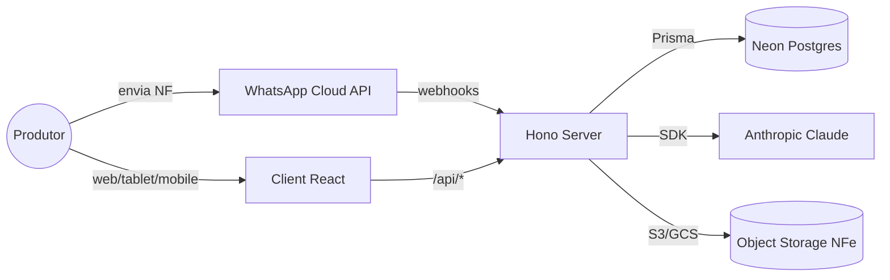

# Fazendinha — Plataforma Inteligente de Pecuária Leiteira

> **Nosso objetivo não é registrar vacas. Nosso objetivo é aumentar a lucratividade das fazendas leiteiras através de dados, automação e inteligência.**

Fazendinha é uma plataforma de gestão completa para propriedades leiteiras. Unifica **financeiro**, **rebanho**, **reprodução**, **sanidade**, **produção**, **estoque**, **custos** e **inteligência artificial** em um único produto, projetado para responder a pergunta que importa para o produtor:

> *"O que devo fazer hoje para ganhar mais dinheiro?"*

A primeira propriedade rodando o produto é a **Fazenda Rio Novo**, que migrou seu fluxo de caixa do Excel/Access (BPO) para o Fazendinha e hoje serve como dataset real de validação (~6.700 lançamentos contábeis + rebanho ativo).

---

## Sumário

- [Visão Geral](#visão-geral)
- [Documentação](#documentação)
- [Stack](#stack)
- [Arquitetura](#arquitetura)
- [Setup Local](#setup-local)
- [Estrutura do Repositório](#estrutura-do-repositório)
- [Scripts](#scripts)
- [Contribuição](#contribuição)
- [Filosofia](#filosofia)
- [Roadmap](#roadmap)

---

## Visão Geral

| Módulo | O que entrega |
|---|---|
| **Financeiro** | DRE em regime de caixa, fluxo de 23 meses, top categorias, projeção de saldo, importação de notas fiscais por OCR e WhatsApp, reclassificação custeio/investimento. |
| **Rebanho** | Cadastro de animais (bovinos e caprinos), genealogia, ficha individual, painel executivo, baixa, busca e filtros. |
| **Reprodução** | Ciclos, IATF, diagnósticos, partos, secagem, IEP projetado, worklists de "a inseminar" e "DG pendente". |
| **Sanidade** | CCS e tendência, mastite por quarto, aplicações com carência, vacinas, exames laboratoriais. |
| **Produção** | Três modos: ordenha individual, total diário, tanque/lote. Curva de lactação, projeção 305d, ranking. |
| **Nutrição** | Dietas (PB%, ED Mcal/kg), atribuição por lote, integração com consumo de estoque. |
| **Estoque** | Saldos, movimentos, custo vaca/dia, ponte automática com financeiro em compras. |
| **Custos** | Custo de produção (R$/litro), custo de sanidade, breakdown por categoria, indicadores zootécnicos cruzados com financeiros. |
| **Inteligência** | Score 0–100 por animal, percentis no rebanho, projeções de lucro, recomendações, assistente conversacional (Claude). |

A plataforma é multi-tenant na intenção (uma propriedade hoje, várias amanhã) e foi modelada contra dados reais do BPO da Rio Novo — **não inventamos campos**.

---

## Documentação

Esta é a fonte de verdade do projeto. Antes de implementar qualquer coisa, leia:

| Documento | Para quem | O que define |
|---|---|---|
| [`PRODUCT.md`](./PRODUCT.md) | Todos | Missão, visão, público, proposta de valor, mentalidade de produto. |
| [`DOMAIN.md`](./DOMAIN.md) | Devs, designers, PMs | Conhecimento profundo do agro leiteiro: DEL, CCS, IEP, lactação, IATF, secagem, mastite, ECC, glossário. |
| [`DESIGN.md`](./DESIGN.md) | Designers, devs UI | Filosofia visual, tipografia, paleta, hierarquia, espaçamento, acessibilidade para o produtor 45–70. |
| [`COMPONENTS.md`](./COMPONENTS.md) | Devs UI | Catálogo dos componentes existentes e quando usar cada um. |
| [`ARCHITECTURE.md`](./ARCHITECTURE.md) | Devs backend e fullstack | Bounded contexts, modelagem, fluxos, organização de pastas, ESM, validação Zod. |
| [`METRICS.md`](./METRICS.md) | PMs, devs, analistas | Fórmulas, origem dos dados e interpretação de cada KPI. |
| [`AI_RULES.md`](./AI_RULES.md) | Claude Code, Cursor, Copilot, ChatGPT | Como qualquer IA deve trabalhar neste projeto (padrões, nomenclatura, anti-padrões). |
| [`ROADMAP.md`](./ROADMAP.md) | Todos | MVP, V1, V2, V3, longo prazo, IoT, integrações. |
| [`CLAUDE.md`](./CLAUDE.md) | Claude Code | Instruções operacionais resumidas para o agente. |
| [`DEPLOY.md`](./DEPLOY.md) | DevOps | Procedimentos de deploy. |

> Toda PR que mude comportamento de produto, vocabulário do domínio ou estrutura visual deve atualizar o documento correspondente. Documentação desatualizada é **bug**.

---

## Stack

| Camada | Tecnologia | Por quê |
|---|---|---|
| Frontend | React 18 + Vite 6 + TypeScript | Build rápido, HMR, tipagem forte. |
| Charts | SVG inline próprio (`client/src/components/charts.tsx`) | Controle total da estética; sem dependência de Recharts/D3. |
| Fontes | Newsreader (serif) + DM Sans (sans) | Editorial e legível em tablets a 60cm de distância. |
| Backend | Hono + `@hono/node-server` | Roteamento leve, tipos preservados, compatível Edge se preciso. |
| Validação | Zod + `@hono/zod-validator` | Schemas únicos para parsing de env, payload e respostas. |
| ORM | Prisma 6 | Migrations declarativas e tipagem ponta-a-ponta. |
| Banco | PostgreSQL serverless via Neon | Branching de banco por feature, custo zero idle. |
| IA | Anthropic Claude (Opus/Sonnet) via SDK oficial | Para WhatsApp+OCR de NF, assistente conversacional e insights. |
| Monorepo | pnpm workspaces (lockfile na raiz) | Instalação rápida, hoisting estrito. |

---

## Arquitetura



- **Cliente** consome `/api/*` (proxy do Vite em dev).
- **Servidor** orquestra Prisma + Claude + storage de notas.
- **Postgres** persiste tudo (financeiro, rebanho, eventos, configuração).
- **Claude** atua em três pontos: extração de campos da NF, confirmação por WhatsApp e respostas no assistente "Rúmi".

Detalhes completos em [`ARCHITECTURE.md`](./ARCHITECTURE.md).

---

## Setup Local

```bash
# 1. Instalar dependências
pnpm install

# 2. Configurar Neon
cp server/.env.example server/.env
# Cole o DATABASE_URL pooled. Para criar migrations, adicione DIRECT_URL.

# 3. Aplicar schema
pnpm prisma:migrate

# 4. (Opcional) Importar dataset real Rio Novo
pnpm --filter rionovo-server run import

# 5. Subir tudo
pnpm dev
```

| Porta | Serviço |
|---|---|
| 41873 | Backend Hono |
| 41875 | Frontend Vite (proxy /api → 41873) |

Abra `http://localhost:41875`.

### Pré-requisitos

- Node **20+** (usamos `--env-file` nativo).
- pnpm **10+**.
- Conta Neon (free tier basta).
- `ANTHROPIC_API_KEY` opcional — sem ela, fluxos de IA caem em modo demo.

---

## Estrutura do Repositório

```
fazendinha/
├── client/                    # Frontend Vite + React
│   └── src/
│       ├── components/        # UI compartilhada (Shell, charts, DateRangePicker, ...)
│       ├── data/              # Mocks do Rio Novo
│       ├── rebanho/           # Módulo Rebanho (componentes, tipos, API, mocks)
│       └── styles/            # CSS modular (base, dashboard, forms, datepicker, ...)
├── server/                    # Backend Hono + Prisma
│   ├── src/
│   │   ├── routes/            # Rotas Hono por domínio
│   │   ├── services/          # Lógica de negócio (incl. rebanho/insights.ts — score 0–100)
│   │   ├── env.ts             # Validação Zod do .env
│   │   ├── db.ts              # PrismaClient singleton HMR-safe
│   │   └── index.ts           # Bootstrap
│   └── prisma/
│       ├── schema.prisma      # 24 models + 17 enums
│       ├── migrations/        # 9 migrations cronológicas
│       └── seed.ts            # Seed financeiro + rebanho
├── scripts/                   # Utilitários (extract_rio_novo.py, etc.)
├── docs/                      # Handoffs, benchmarks, notas internas
├── PRODUCT.md DOMAIN.md DESIGN.md COMPONENTS.md
├── ARCHITECTURE.md METRICS.md AI_RULES.md ROADMAP.md
├── README.md CLAUDE.md DEPLOY.md
├── package.json pnpm-workspace.yaml pnpm-lock.yaml
└── tsconfig*.json
```

---

## Scripts

| Comando | O que faz |
|---|---|
| `pnpm dev` | Sobe server (41873) e client (41875) em paralelo. |
| `pnpm dev:server` | Só backend. |
| `pnpm dev:client` | Só frontend. |
| `pnpm build` | Build de produção dos dois workspaces. |
| `pnpm prisma:generate` | Regera Prisma Client. |
| `pnpm prisma:migrate` | `prisma migrate dev` (requer `DIRECT_URL`). |
| `pnpm prisma:studio` | Abre Prisma Studio. |
| `pnpm --filter rionovo-server run seed` | Popula dados de exemplo. |
| `pnpm --filter rionovo-server run import` | Importa dataset real do BPO Rio Novo. |
| `pnpm --filter rionovo-server exec prisma migrate deploy` | Aplica migrations existentes via pooler (sem shadow DB). |

---

## Contribuição

1. Leia `PRODUCT.md` e `DOMAIN.md` antes de propor qualquer feature. Quem não conhece o domínio gera código que parece certo mas dá conselho errado para o produtor.
2. Toda PR de feature precisa responder em 1 linha: **qual decisão do produtor isso melhora?**
3. Toda nova tela ou componente segue [`DESIGN.md`](./DESIGN.md) e reusa de [`COMPONENTS.md`](./COMPONENTS.md). Não criar componentes paralelos.
4. Validação de payload com Zod no backend; nada de `c.req.json() as any`.
5. Identificadores em **português** consistentes com o schema (`Lancamento`, `Animal`, `Categoria`).
6. Commits em PT-BR no padrão `feat(modulo): mensagem` (veja histórico em `git log`).
7. Não há suite de testes obrigatória ainda — mas `vitest` está disponível no server; testes puros de cálculo (insights, custo, percentis) são bem-vindos.

---

## Filosofia

Esses cinco princípios estão acima de qualquer feature. Eles são detalhados em [`PRODUCT.md`](./PRODUCT.md):

1. **Dados viram decisões.** Toda tela deve responder a uma pergunta de negócio, não exibir dados pelo prazer de exibir.
2. **Lucratividade primeiro.** Indicadores zootécnicos só importam quando ligados ao bolso.
3. **Produtor é o usuário, não o agrônomo.** Interface para alguém que aprendeu a operar no Excel e prefere clareza a modernidade.
4. **Profundidade > Vastidão.** Antes de adicionar um módulo, esgotar o módulo existente.
5. **Verdade > Aparência.** Não inflar números. Não esconder prejuízo. Não enfeitar projeções.

---

## Roadmap

Resumo (detalhe em [`ROADMAP.md`](./ROADMAP.md)):

- **MVP** ✅ — financeiro do BPO + cadastro de animais + ficha individual + painel executivo.
- **V1 (atual)** — núcleo entregue: produção integrada (3 modos), reprodução completa (IATF configurável, DG, partos), sanidade (carência, vacinação com lembrete), painel "Hoje", estoque↔sanidade, simulações financeiras read-only. Restam NF por foto no WhatsApp, CMT via tablet, mastite por quarto.
- **V2** — IA preditiva (descarte, prenhez, mastite subclínica), WhatsApp como interface principal de lançamento.
- **V3** — integrações IoT (ordenhadeira, balanças, colares), marketplace de insumos, benchmarking entre fazendas.
- **Longo prazo** — aplicativo nativo, BI próprio, score de crédito rural derivado da operação.

---

## Licença

Software proprietário. Todos os direitos reservados.

## Contato

Time interno — ver `CLAUDE.md` para instruções operacionais do agente e `docs/HANDOFF-*.md` para passagens de bastão.
