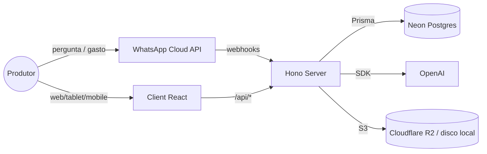

# Fazendinha — Plataforma Inteligente de Pecuária Leiteira

> **Nosso objetivo não é registrar vacas. Nosso objetivo é aumentar a lucratividade das fazendas leiteiras através de dados, automação e inteligência.**

Fazendinha é uma plataforma de gestão completa para propriedades leiteiras. Unifica **financeiro**, **rebanho**, **reprodução**, **sanidade**, **produção**, **estoque**, **custos** e **inteligência artificial** em um único produto, projetado para responder a pergunta que importa para o produtor:

> *"O que devo fazer hoje para ganhar mais dinheiro?"*

A primeira propriedade rodando o produto é a **Fazenda Rio Novo**, que migrou seu fluxo de caixa do Excel/Access (BPO) para o Fazendinha e hoje serve como dataset real de validação (~6.700 lançamentos contábeis + rebanho ativo).

---

## Sumário

- [Visão Geral](#visão-geral)
- [Documentação](#documentação)
- [Stack](#stack)
- [Arquitetura](#arquitetura)
- [Setup Local](#setup-local)
- [Estrutura do Repositório](#estrutura-do-repositório)
- [Scripts](#scripts)
- [Contribuição](#contribuição)
- [Filosofia](#filosofia)
- [Roadmap](#roadmap)

---

## Visão Geral

| Módulo | O que entrega |
|---|---|
| **Financeiro** | Reconstruído em torno de `Operacao` → `CompromissoFinanceiro` → `TransacaoFinanceira` → `MovimentoConta` em `ContaFinanceira`. Rascunho de operação, documentos anexos, períodos fechados (mês fechado bloqueia escrita), estorno com auditoria. Regime de caixa: DRE, fluxo de 23 meses, top categorias, projeção de saldo, reclassificação custeio/investimento. Lançamento de gastos também pelo bot do WhatsApp. |
| **Rebanho** | Cadastro de animais (bovinos e caprinos), genealogia, ficha individual, painel executivo, baixa, busca e filtros. |
| **Lotes (corte)** | Dentro de "Pecuária" na navegação: lotes coletivos, piquetes/pasto, pesagens, sanidade e nutrição coletivas, comercialização, custo por lote. |
| **Reprodução** | Ciclos, IATF, diagnósticos, partos, secagem, IEP projetado, worklists, relatórios configuráveis e formulários de campo imprimíveis que retornam para lançamento em grade. |
| **Sanidade** | CCS e tendência, mastite por quarto, aplicações com carência, vacinas, exames laboratoriais. |
| **Produção** | Três modos: ordenha individual, total diário, tanque/lote. Curva de lactação, projeção 305d, ranking. |
| **Nutrição** | Dietas (PB%, ED Mcal/kg), atribuição por lote, integração com consumo de estoque. |
| **Estoque** | Saldos, movimentos, custo vaca/dia, ponte automática com financeiro em compras. |
| **Custos** | Custo de produção (R$/litro), custo de sanidade, breakdown por categoria, indicadores zootécnicos cruzados com financeiros. |
| **Inteligência** | Score 0–100 por animal, percentis no rebanho, projeções de lucro, recomendações, assistente conversacional e bot WhatsApp (OpenAI, `gpt-4o` por padrão) consultando um motor estruturado — sem SQL gerado pelo LLM. |
| **Agronomia** | Café (talhões, fenologia, MIP, adubação, colheita, apontamento de máquinas) e milho/safras (áreas, produção, silos, custo por safra). |
| **Equipe** | Funcionários, ponto, folha e rateio de mão de obra por setor. |
| **Contas e acessos** | Usuários com sessão, papéis (presets), áreas e flags de permissão; dono criado no primeiro boot. Multi-propriedade (escopo de sítio) transversal. |

A plataforma é multi-tenant na intenção (uma propriedade hoje, várias amanhã) e foi modelada contra dados reais do BPO da Rio Novo — **não inventamos campos**.

---

## Documentação

Esta é a fonte de verdade do projeto. Antes de implementar qualquer coisa, leia:

| Documento | Para quem | O que define |
|---|---|---|
| [`PRODUCT.md`](./PRODUCT.md) | Todos | Missão, visão, público, proposta de valor, mentalidade de produto. |
| [`DOMAIN.md`](./DOMAIN.md) | Devs, designers, PMs | Conhecimento profundo do agro leiteiro: DEL, CCS, IEP, lactação, IATF, secagem, mastite, ECC, glossário. |
| [`DESIGN.md`](./DESIGN.md) | Designers, devs UI | Filosofia visual, tipografia, paleta, hierarquia, espaçamento, acessibilidade para o produtor 45–70. |
| [`COMPONENTS.md`](./COMPONENTS.md) | Devs UI | Catálogo dos componentes existentes e quando usar cada um. |
| [`ARCHITECTURE.md`](./ARCHITECTURE.md) | Devs backend e fullstack | Bounded contexts, modelagem, fluxos, organização de pastas, ESM, validação Zod. |
| [`METRICS.md`](./METRICS.md) | PMs, devs, analistas | Fórmulas, origem dos dados e interpretação de cada KPI. |
| [`AI_RULES.md`](./AI_RULES.md) | Claude Code, Cursor, Copilot, ChatGPT | Como qualquer IA deve trabalhar neste projeto (padrões, nomenclatura, anti-padrões). |
| [`ROADMAP.md`](./ROADMAP.md) | Todos | MVP, V1, V2, V3, longo prazo, IoT, integrações. |
| [`CLAUDE.md`](./CLAUDE.md) | Claude Code | Instruções operacionais resumidas para o agente. |
| [`DEPLOY.md`](./DEPLOY.md) | DevOps | Procedimentos de deploy (Cloudflare Pages + Render + Neon). |
| [`TODO.md`](./TODO.md) | Todos | Pendências correntes. |

Notas de trabalho na raiz: `ANALISE-ROTAS.md`, `AUDITORIA-2026-07-06.md`, `HANDOFF-sprint-pre-teste-2026-07-06.md`, `PLANO-dashboard-ia.md`.

Em `docs/`:

- **Design specs** — `docs/design/` (`multi-propriedade.md`, `pecuaria-unificada.md`, `reproducao-paridade-ideagri.md`, `ia-consulta-semantica.md`, `relatorios-gerais.md`, `dieta-estoque-baixa-automatica.md`, `ocr-folhas-setor.md`, `ideagri-catalogo-features.md`, `ideagri-gaps.md`, painel milho/equipe).
- **Planos e specs por fatia** — `docs/superpowers/plans/` e `docs/superpowers/specs/` (rebanho fatia 1–18, reprodução blocos A–C, shadcn fases 0–5, auth/contas, central de relatórios).
- **Financeiro novo** — `financeiro-rebuild-contrato.md`, `proposta-reestruturacao-financeiro.md`, `handoff-design-novo-financeiro.md`, `avaliacao-produto-financeiro-2026-09-01.md`.
- **Navegação e QA** — `NAVEGACAO.md` (gerado por `pnpm gen:nav-doc`), `QA-pecuaria-unificada.md`, `HOMOLOGACAO-codex-semana-2026-08-05.md`, `bateria-ia-consultas-2026-07-14.md`, `auditoria-indicadores-zootecnicos.md`.
- **Campo e benchmark** — `visita-fazenda-*.md`, `feedback-fazenda-2026-07-21-diagnostico.md`, `benchmark-ideagri.md`, `reproducao-runbook-maquina-dados.md`, `reproducao-teste-na-maquina-ideagri.md`.
- **Handoffs** — `HANDOFF-*.md`.

> Toda PR que mude comportamento de produto, vocabulário do domínio ou estrutura visual deve atualizar o documento correspondente. Documentação desatualizada é **bug**.

---

## Stack

| Camada | Tecnologia | Por quê |
|---|---|---|
| Frontend | React 18 + Vite 6 + TypeScript | Build rápido, HMR, tipagem forte. Sem react-router: `App.tsx` troca abas por estado e `router.ts` faz a ponte com o pathname. |
| UI | Tailwind CSS v4 (`@tailwindcss/vite`) + primitivas shadcn-style em `client/src/components/ui/` (Radix, cmdk, lucide-react, cva, tailwind-merge) | Componentes acessíveis sobre a paleta própria em `styles/base.css`. |
| Charts | SVG inline próprio (`client/src/components/charts.tsx`) | Controle total da estética; sem Recharts/D3. |
| Fontes | Newsreader (serif) + DM Sans (sans) | Editorial e legível em tablets a 60cm de distância. |
| Backend | Hono + `@hono/node-server` | Roteamento leve, tipos preservados, compatível Edge se preciso. |
| Validação | Zod + `@hono/zod-validator` | Schemas únicos para parsing de env, payload e respostas. |
| ORM | Prisma 6 | Migrations declarativas e tipagem ponta-a-ponta. |
| Banco | PostgreSQL serverless via Neon | Branching de banco por feature, custo zero idle. |
| IA | OpenAI (`openai`, `gpt-4o` por padrão) | Bot WhatsApp (Meta Cloud API), assistente conversacional e insights. Sem chave, cai em modo demonstração. |
| Anexos | `@aws-sdk/client-s3` (Cloudflare R2) ou disco local | Documentos financeiros e notas. `tesseract.js`/`sharp`/`pdf-parse` estão instalados, mas o OCR não está ligado a nenhuma rota. |
| Testes | Vitest nos dois workspaces | ~60 arquivos `*.test.ts` ao lado do código, maioria em `server/src/services/**`. |
| Monorepo | pnpm workspaces (lockfile na raiz) | Instalação rápida, hoisting estrito. |
| Deploy | Cloudflare Pages (client, `_worker.js` faz proxy de `/api`) + Render (`render.yaml`) + Neon | CI de staging em `.github/workflows/staging.yml`. |

---

## Arquitetura



- **Cliente** consome `/api/*` (proxy do Vite em dev; `_worker.js` do Cloudflare Pages em prod). Toda request passa por `comPropriedade()`, que injeta o token de sessão e `X-Propriedade-Id`.
- **Servidor** Hono modular (~50 roteadores finos que delegam a `services/`). Auth por **sessão** (`Usuario`/`Sessao`) com papéis, áreas e flags; `SHARED_ACCESS_TOKEN` sobrevive só como ponte de transição. Rotas isentas: `/api/health` e `/api/whatsapp/*`.
- **Postgres (Neon)** persiste tudo (financeiro, rebanho, eventos, configuração). Escopo multi-propriedade via `propriedadeId` com backfill no boot.
- **OpenAI** atua no bot WhatsApp (respostas e lançamento de gastos via motor de consulta estruturado), no assistente e nos insights.
- **Deploy**: Cloudflare Pages (frontend) + Render (backend; sync de schema é passo manual — ver DEPLOY.md) + Neon.

Detalhes completos em [`ARCHITECTURE.md`](./ARCHITECTURE.md).

---

## Setup Local

```bash
# 1. Instalar dependências
pnpm install

# 2. Configurar Neon
cp server/.env.example server/.env
# Mínimo: DATABASE_URL (pooled). Adicione DIRECT_URL para db push / migrate dev.
# Opcional: AUTH_BOOTSTRAP_EMAIL cria o dono (pendente) no primeiro boot e loga
# o link de definir senha. Sem usuários e sem SHARED_ACCESS_TOKEN, a porta fica
# aberta em dev.

# 3. Subir tudo (`dev:server` roda `prisma db push` antes do watch)
pnpm dev

# 4. (Opcional) Dados de exemplo
pnpm --filter rionovo-server run seed:all       # todos os módulos, incluindo o rebanho real
```

| Porta | Serviço |
|---|---|
| 41873 | Backend Hono |
| 41875 | Frontend Vite (proxy /api → 41873) |

Abra `http://localhost:41875`.

### Pré-requisitos

- Node **20+** (usamos `--env-file` nativo).
- pnpm **10+**.
- Conta Neon (free tier basta).
- `OPENAI_API_KEY` opcional — sem ela, bot desligado (503) e IA em modo demo.
- Demais variáveis (`WHATSAPP_*`, `STORAGE_DRIVER`/`R2_*`, `CORS_ORIGIN`, `APP_BASE_URL`, `AUTH_SESSAO_DIAS`) são opcionais e validadas por Zod em `server/src/env.ts`.

---

## Estrutura do Repositório

```
fazendinha/
├── client/                    # Frontend Vite + React
│   ├── public/_worker.js      # Cloudflare Pages: proxy /api/* → Render + SPA fallback
│   └── src/
│       ├── App.tsx router.ts  # Troca de abas por estado + ponte com pathname
│       ├── api.ts api/auth.ts # Fetch do financeiro legado e de auth/sessão
│       ├── propriedadeScope.ts# Sítio ativo + comPropriedade() (envelope de toda request)
│       ├── components/        # Shell, AppSidebar, CommandPalette, Login, charts, pickers
│       │   └── ui/            # Primitivas shadcn-style (button, dialog, select, sheet, ...)
│       ├── financeiro/        # Operações, compromissos, contas, relatórios (novo-api.ts)
│       ├── rebanho/ corte/ plantio/ cultivo/ equipe/   # Módulos operacionais
│       ├── lib/               # auth, hoje, searchIndex, areas, reconciliacao, utils
│       ├── data/              # Mocks/referência de forma (rionovo.ts, acessos)
│       └── styles/            # CSS modular (base define as variáveis, dashboard, forms, ...)
├── server/                    # Backend Hono + Prisma
│   ├── src/
│   │   ├── routes/            # Roteadores finos por domínio (auth, financeiro, usuarios, whatsapp, rebanho/, corte/, plantio/, cultivo/, ponto/)
│   │   ├── services/          # Regra de negócio testada
│   │   │   ├── auth/          # Usuário, sessão, papéis/áreas/flags, bootstrap do dono
│   │   │   ├── financeiro/    # operacoes, rascunhos, contas, documentos, regras, dashboard
│   │   │   ├── consulta/      # Motor estruturado de consultas do bot
│   │   │   ├── bot/ whatsapp/ # Assistente OpenAI + canal Meta Cloud API
│   │   │   └── rebanho/ corte/ plantio/ cultivo/ ponto/
│   │   ├── middleware/auth.ts # Sessão / token compartilhado
│   │   ├── lib/               # storage (local/R2), ocr
│   │   ├── env.ts             # Validação Zod do .env
│   │   ├── db.ts              # PrismaClient singleton HMR-safe
│   │   └── index.ts           # Bootstrap (backfill multi-propriedade, cleanup)
│   ├── scripts/               # bateria-ia (gabarito/run)
│   └── prisma/
│       ├── schema.prisma      # ~120 models + ~65 enums
│       ├── migrations/        # migrations cronológicas (sync em prod é manual: migrate deploy ou db push)
│       ├── seed*.ts import-rebanho.ts
│       └── rio_novo.json rebanho_real.json   # Dados reais extraídos
├── scripts/                   # extract_rio_novo.py, gen-nav-doc.ts
├── docs/                      # design/, superpowers/{plans,specs}, handoffs, QA, visitas
├── .github/workflows/staging.yml
├── render.yaml                # Blueprint do backend no Render
├── PRODUCT.md DOMAIN.md DESIGN.md COMPONENTS.md
├── ARCHITECTURE.md METRICS.md AI_RULES.md ROADMAP.md
├── README.md CLAUDE.md DEPLOY.md TODO.md
├── package.json pnpm-workspace.yaml pnpm-lock.yaml
└── tsconfig*.json
```

---

## Scripts

| Comando | O que faz |
|---|---|
| `pnpm dev` | Sobe server (41873) e client (41875) em paralelo. |
| `pnpm dev:server` | Só backend (roda `prisma db push` antes do watch). |
| `pnpm dev:client` | Só frontend. |
| `pnpm build` | Build de produção dos dois workspaces. |
| `pnpm prisma:generate` | Regera Prisma Client. |
| `pnpm prisma:migrate` | `prisma migrate dev` (requer `DIRECT_URL`). |
| `pnpm prisma:studio` | Abre Prisma Studio. |
| `pnpm gen:nav-doc` | Regera `docs/NAVEGACAO.md` a partir da navegação. |
| `pnpm --filter rionovo-server run db:push` | Sincroniza o schema sem migration (o que roda em prod). |
| `pnpm --filter rionovo-server run seed` | Dados de exemplo do financeiro. |
| `pnpm --filter rionovo-server run seed:usuarios` | Usuários de exemplo. |
| `pnpm --filter rionovo-server run seed:rebanho` / `seed:plantio` / `seed:plantios` / `seed:corte` / `seed:ponto` | Seeds por módulo. |
| `pnpm --filter rionovo-server run seed:all` | Todos os seeds e o rebanho real, sem resetar o banco; também roda automaticamente após `prisma migrate reset`. |
| `pnpm --filter rionovo-server run import:rebanho` | Reimporta separadamente o `rebanho_real.json`, substituindo os animais atuais. |
| `pnpm --filter rionovo-server run whatsapp:user` | Gerencia a allowlist de números do bot. |
| `pnpm --filter rionovo-server run bateria:gabarito` / `bateria:run` | Bateria de consultas de IA (gera gabarito / executa). |
| `pnpm --filter rionovo-server run test` | Testes do backend (Vitest). |
| `pnpm --filter rionovo-client run test` | Testes do frontend. |
| `pnpm --filter rionovo-server exec prisma migrate deploy` | Aplica migrations existentes via pooler (sem shadow DB). |

---

## Contribuição

1. Leia `PRODUCT.md` e `DOMAIN.md` antes de propor qualquer feature. Quem não conhece o domínio gera código que parece certo mas dá conselho errado para o produtor.
2. Toda PR de feature precisa responder em 1 linha: **qual decisão do produtor isso melhora?**
3. Toda nova tela ou componente segue [`DESIGN.md`](./DESIGN.md) e reusa de [`COMPONENTS.md`](./COMPONENTS.md). Não criar componentes paralelos.
4. Validação de payload com Zod no backend; nada de `c.req.json() as any`.
5. Identificadores em **português** consistentes com o schema (`Operacao`, `Animal`, `Categoria`).
6. Commits em PT-BR no padrão `feat(modulo): mensagem` (veja histórico em `git log`).
7. Rota fina → service → cálculo puro (`*.calc.ts`) com teste ao lado (`*.test.ts`). Rode `pnpm --filter rionovo-server run test` antes de abrir PR.

---

## Filosofia

Esses cinco princípios estão acima de qualquer feature. Eles são detalhados em [`PRODUCT.md`](./PRODUCT.md):

1. **Dados viram decisões.** Toda tela deve responder a uma pergunta de negócio, não exibir dados pelo prazer de exibir.
2. **Lucratividade primeiro.** Indicadores zootécnicos só importam quando ligados ao bolso.
3. **Produtor é o usuário, não o agrônomo.** Interface para alguém que aprendeu a operar no Excel e prefere clareza a modernidade.
4. **Profundidade > Vastidão.** Antes de adicionar um módulo, esgotar o módulo existente.
5. **Verdade > Aparência.** Não inflar números. Não esconder prejuízo. Não enfeitar projeções.

---

## Roadmap

Resumo (detalhe em [`ROADMAP.md`](./ROADMAP.md)):

- **MVP** ✅ — financeiro do BPO + cadastro de animais + ficha individual + painel executivo.
- **V1 (atual)** — núcleo entregue: produção integrada (3 modos), reprodução completa (IATF configurável, DG, partos), sanidade (carência, vacinação com lembrete), painel "Hoje", estoque↔sanidade, simulações financeiras read-only. Restam NF por foto no WhatsApp, CMT via tablet, mastite por quarto.
- **V2** — IA preditiva (descarte, prenhez, mastite subclínica), WhatsApp como interface principal de lançamento.
- **V3** — integrações IoT (ordenhadeira, balanças, colares), marketplace de insumos, benchmarking entre fazendas.
- **Longo prazo** — aplicativo nativo, BI próprio, score de crédito rural derivado da operação.

---

## Licença

Software proprietário. Todos os direitos reservados.

## Contato

Time interno — ver `CLAUDE.md` para instruções operacionais do agente e `docs/HANDOFF-*.md` / `HANDOFF-*.md` na raiz para passagens de bastão.
