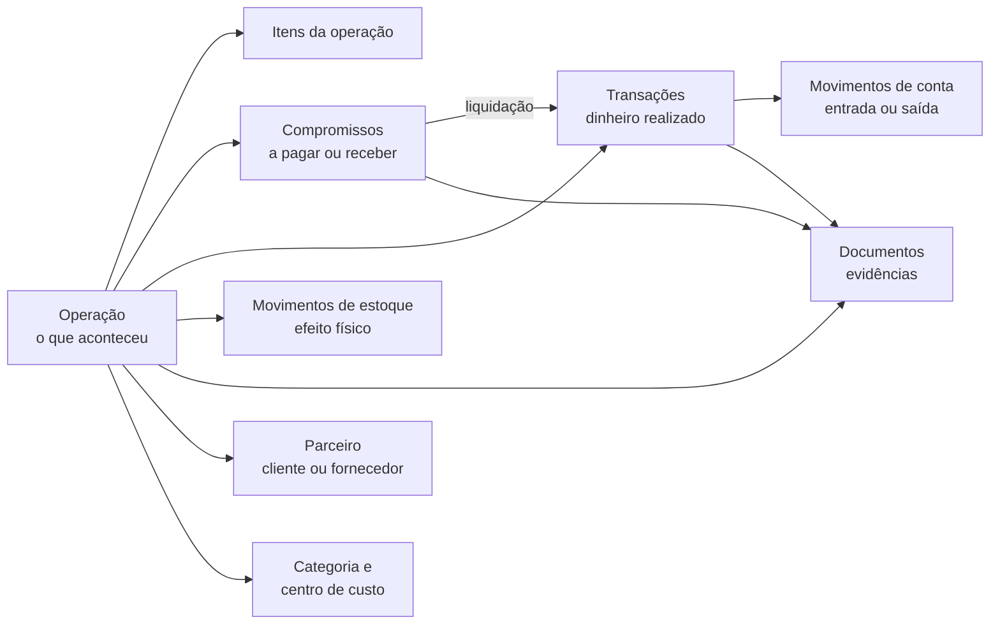

# Handoff para Design — Novo Financeiro

**Projeto:** Terrano — Plataforma de Gestão Rural
**Objetivo:** orientar a criação das páginas do novo módulo Financeiro a partir do schema e das regras de negócio já implementados.
**Público deste documento:** Product Design, UX/UI e implementação de interface.
**Escopo:** visão conceitual e funcional. Os nomes técnicos do banco aparecem apenas para manter rastreabilidade com o sistema.

---

## 1. Resumo do produto

O Financeiro deixa de ser apenas uma lista de lançamentos e passa a representar três momentos diferentes:

1. **O que aconteceu no negócio:** uma operação.
2. **O que ainda precisa ser pago ou recebido:** um compromisso.
3. **O dinheiro que realmente entrou ou saiu:** uma transação financeira.

Movimentos físicos de estoque e documentos comprobatórios são consequências ou evidências desses acontecimentos.

> Regra central: somente movimentos confirmados em contas financeiras alteram o saldo. Uma conta futura a pagar ou receber não altera o saldo até sua liquidação.

Para o usuário, esses conceitos não devem resultar em vários cadastros repetitivos. Ele registra o acontecimento uma vez e o sistema cria os efeitos necessários.

---

## 2. Mapa conceitual



Uma operação pode gerar:

- apenas estoque;
- apenas um compromisso futuro;
- apenas dinheiro realizado;
- estoque e compromisso;
- estoque e dinheiro realizado;
- compromisso e várias transações parciais;
- nenhum efeito financeiro, quando for um evento físico ou ajuste justificado.

---

## 3. Entidades principais

### 3.1. Conta financeira (`ContaFinanceira`)

Representa onde o dinheiro existe.

Tipos disponíveis:

- **Banco:** conta bancária tradicional.
- **Caixa:** caixinha ou fundo físico/operacional.
- **Aplicação:** valor aplicado que deve compor ou não a disponibilidade.
- **Dinheiro:** numerário físico fora de uma caixinha específica.

Informações importantes para a interface:

- nome;
- tipo;
- instituição;
- identificação da conta;
- saldo de abertura e sua data;
- saldo atual calculado;
- se participa do saldo geral;
- ativa ou inativa.

#### Regra de saldo

```text
Saldo da conta = saldo de abertura + entradas confirmadas − saídas confirmadas

Saldo geral = soma das contas ativas marcadas para participar do saldo geral
```

O saldo atual não é um campo editável. Ele é uma projeção calculada pelo razão da conta.

---

### 3.2. Parceiro (`Parceiro`)

É a pessoa ou organização com quem a fazenda se relaciona financeiramente.

Papéis disponíveis:

- cliente;
- fornecedor;
- cliente e fornecedor;
- funcionário;
- proprietário;
- outro.

Informações:

- nome;
- CPF/CNPJ ou outro documento;
- telefone;
- e-mail;
- papel;
- ativo ou inativo.

Desativar um parceiro não apaga seu histórico. Operações, compromissos e transações antigas continuam vinculados a ele.

---

### 3.3. Operação (`Operacao`)

É o registro central do domínio. Responde: **o que aconteceu na fazenda?**

Tipos atuais:

| Tipo interno | Nome recomendado na interface | Efeito comum |
|---|---|---|
| `COMPRA_ESTOQUE` | Compra para estoque | Entrada física e pagamento ou compromisso |
| `COMPRA_CONSUMO_DIRETO` | Compra para consumo direto | Pagamento ou compromisso, sem entrada em estoque |
| `SERVICO` | Contratação de serviço | Pagamento ou compromisso |
| `VENDA` | Venda | Recebimento ou compromisso; pode retirar estoque |
| `APORTE` | Aporte | Entrada de dinheiro |
| `RETIRADA` | Retirada | Saída de dinheiro |
| `TRANSFERENCIA_FINANCEIRA` | Transferência entre contas | Saída em uma conta e entrada em outra |
| `AJUSTE_ESTOQUE` | Ajuste de estoque | Correção física justificada |
| `TRANSFERENCIA_ESTOQUE` | Transferência de estoque | Saída e entrada físicas |
| `INVENTARIO_INICIAL` | Inventário inicial | Constituição da posição física inicial |
| `BONIFICACAO` | Bonificação recebida | Entrada física sem pagamento obrigatório |
| `DEVOLUCAO` | Devolução | Reversão física e eventual efeito financeiro |
| `PRODUCAO` | Produção própria | Entrada física produzida pela fazenda |

Status:

- **Rascunho:** ainda editável e sem efeitos confirmados.
- **Confirmada:** fato efetivado; seus efeitos passam a valer.
- **Cancelada:** efeitos neutralizados por estornos; histórico preservado.

Campos relevantes:

- data;
- descrição;
- propriedade;
- parceiro;
- categoria gerencial;
- centro de custo;
- valor total;
- responsável pela criação;
- itens;
- compromissos;
- transações;
- movimentos de estoque;
- documentos.

#### Condição financeira da operação

A condição é escolhida durante o cadastro, mas não é uma entidade separada:

- **À vista:** cria uma transação imediata; não cria compromisso.
- **A prazo:** cria compromisso; não movimenta conta.
- **Parcial:** cria transação pelo valor realizado e compromisso apenas pelo restante.
- **Sem efeito financeiro:** registra somente o fato e seus possíveis efeitos físicos.

---

### 3.4. Item da operação (`ItemOperacao`)

Detalha produtos ou serviços envolvidos na operação.

Informações:

- produto cadastrado, quando aplicável;
- descrição;
- quantidade;
- unidade;
- valor unitário;
- valor total;
- indicação se o item afeta estoque.

O formulário deve permitir mais de um item e apresentar subtotal por linha e total consolidado.

---

### 3.5. Compromisso financeiro (`CompromissoFinanceiro`)

Representa um valor futuro a pagar ou receber. Não representa dinheiro movimentado.

Tipos:

- **A pagar**;
- **A receber**.

Status financeiros:

- **Pendente:** nenhuma liquidação confirmada.
- **Parcial:** parte do valor foi liquidada.
- **Liquidado:** saldo pendente igual a zero.
- **Cancelado:** obrigação neutralizada.

Informações:

- operação de origem;
- parceiro;
- valor original;
- valor liquidado calculado;
- saldo pendente calculado;
- vencimento;
- número e total de parcelas;
- documentos;
- liquidações realizadas.

#### Vencimento não é status

“Vencido”, “vence hoje” e “vence em cinco dias” são condições de prazo apresentadas como alertas. O status financeiro continua sendo pendente, parcial, liquidado ou cancelado.

---

### 3.6. Transação financeira (`TransacaoFinanceira`)

Representa dinheiro efetivamente realizado.

Tipos:

- pagamento;
- recebimento;
- transferência;
- aporte;
- retirada;
- ajuste;
- reversão.

Status:

- **Confirmada**;
- **Revertida**.

Formas de pagamento:

- PIX;
- transferência bancária;
- boleto;
- dinheiro;
- cartão;
- cheque;
- débito automático;
- outro.

Informações:

- data;
- valor;
- forma de pagamento;
- descrição;
- parceiro;
- operação de origem, quando houver;
- conta ou contas afetadas;
- usuário responsável;
- comprovantes;
- transação de reversão, quando houver.

Uma transação pode existir sem operação para ajustes, aportes ou retiradas excepcionais, mas o fluxo preferencial parte da operação ou da liquidação de um compromisso.

---

### 3.7. Movimento de conta (`MovimentoConta`)

É o razão financeiro e a única entidade que efetivamente altera o saldo.

Cada movimento possui:

- conta;
- direção: entrada ou saída;
- valor;
- transação que o originou.

Essa entidade deve aparecer para o usuário como **extrato da conta**, e não como um cadastro independente.

Uma transferência entre contas próprias cria:

```text
Conta de origem  → saída de R$ 1.000
Conta de destino → entrada de R$ 1.000
Saldo geral      → impacto de R$ 0
```

---

### 3.8. Liquidação (`Liquidacao`)

É o vínculo entre um compromisso e uma transação.

Permite:

- pagar parcialmente uma obrigação;
- usar contas diferentes em pagamentos diferentes;
- registrar recebimentos parciais;
- rastrear exatamente qual pagamento liquidou qual parcela.

Liquidação não precisa ser apresentada como uma área própria. Ela deve aparecer na linha do tempo do compromisso e no modal de pagamento ou recebimento.

---

### 3.9. Movimento de estoque (`MovimentoEstoque`)

Representa o efeito físico de uma operação.

Possui:

- produto;
- entrada, saída ou ajuste;
- origem do movimento;
- quantidade e custo;
- operação e item que justificam o movimento;
- propriedade;
- usuário responsável;
- reversão, quando aplicável.

Regra de produto:

> Entradas de compra devem nascer da operação de compra. O usuário não deve cadastrar novamente a entrada pela tela de estoque.

Consumos automáticos de nutrição ou sanidade podem ser justificados pelo evento operacional correspondente, sem uma compra nova.

---

### 3.10. Documento financeiro (`DocumentoFinanceiro`)

Representa evidências anexadas ao processo.

Tipos:

- nota fiscal;
- boleto;
- contrato;
- recibo;
- comprovante;
- justificativa;
- outro.

O documento pode estar ligado a:

- uma operação;
- um compromisso;
- uma transação.

Exemplo:

- nota fiscal ligada à compra;
- boleto ligado ao compromisso;
- comprovante bancário ligado ao pagamento.

O schema já suporta metadados e referência de armazenamento. O envio físico e a gestão dos arquivos ainda precisam ser conectados na API e na interface.

---

### 3.11. Período financeiro (`PeriodoFinanceiro`)

Controla abertura e fechamento mensal por propriedade.

Status:

- aberto;
- fechado.

Quando fechado, o período bloqueia novos movimentos e estornos naquela competência. A reabertura deve exigir permissão, justificativa e registro de auditoria.

O schema e as regras internas já reconhecem o fechamento. A página administrativa completa ainda precisa ser construída.

---

### 3.12. Auditoria financeira (`AuditoriaFinanceira`)

Registra ações relevantes:

- entidade afetada;
- ação realizada;
- motivo;
- estado anterior;
- estado posterior;
- usuário;
- data e hora.

Não deve ser uma tabela técnica exposta sem tratamento. Na interface, deve virar uma linha do tempo legível, por exemplo:

```text
01/09/2026 às 14:32 · Mariana confirmou a operação
05/09/2026 às 09:10 · João registrou pagamento de R$ 4.000
08/09/2026 às 16:45 · Mariana estornou o pagamento
Motivo: conta bancária informada incorretamente
```

---

## 4. Fluxos que o design precisa representar

### 4.1. Compra à vista para estoque

Uma única confirmação gera:

- operação de compra;
- entrada no estoque;
- pagamento;
- saída na conta escolhida;
- nenhum compromisso futuro.

### 4.2. Compra a prazo para estoque

Uma única confirmação gera:

- operação de compra;
- entrada no estoque;
- compromisso a pagar;
- nenhuma movimentação de conta naquele momento.

### 4.3. Compra parcialmente paga

Uma única confirmação gera:

- operação;
- entrada no estoque;
- transação pelo valor pago agora;
- compromisso somente pelo saldo restante.

### 4.4. Serviço à vista

Gera operação e pagamento. Não altera estoque.

### 4.5. Serviço a prazo

Gera operação e compromisso. Não altera saldo nem estoque.

### 4.6. Venda recebida

Gera operação e recebimento. Se o item for estocável, também gera saída física.

### 4.7. Pagamento futuro

Na página do compromisso, o usuário informa:

- conta utilizada;
- valor;
- data;
- forma de pagamento;
- comprovante;
- observação opcional.

O sistema cria a transação, reduz o saldo e atualiza o compromisso para parcial ou liquidado.

### 4.8. Transferência entre contas

O usuário escolhe origem, destino, valor, data e descrição. O sistema muda a distribuição entre contas, mas não altera o saldo geral.

### 4.9. Estorno

Estornar nunca apaga o registro original. O fluxo deve:

1. mostrar claramente todos os efeitos que serão neutralizados;
2. exigir motivo textual;
3. solicitar confirmação explícita;
4. criar movimentos inversos;
5. preservar documentos, responsáveis e histórico.

---

## 5. Arquitetura recomendada das páginas

### 5.1. Visão geral financeira

**Rota:** `/financeiro`

Objetivo: responder rapidamente quanto a fazenda possui, o que realizou e o que está previsto.

Blocos recomendados:

1. saldo geral atual;
2. recebimentos realizados no período;
3. pagamentos realizados no período;
4. total a pagar;
5. total a receber;
6. saldo individual das contas;
7. despesas por categoria;
8. fluxo realizado ao longo do período;
9. próximos vencimentos;
10. alertas independentes do filtro mensal, claramente identificados como alertas atuais.

Regras de apresentação:

- filtros de período afetam somente indicadores marcados como “no período”;
- saldo atual não deve aparentar depender do mês selecionado;
- compromissos devem ficar visualmente separados do realizado;
- transferências não devem ser interpretadas como receita ou despesa;
- usar “pagamentos” e “recebimentos” quando o dado representa caixa realizado;
- usar “receitas” e “despesas” somente quando houver classificação econômica compatível.

---

### 5.2. Operações

**Rota:** `/financeiro/operacoes`

Objetivo: consultar e registrar os acontecimentos financeiros e econômicos.

Filtros:

- período;
- tipo;
- status;
- parceiro;
- categoria;
- centro de custo;
- com ou sem estoque;
- com ou sem compromisso;
- busca por descrição, documento ou identificador.

Colunas recomendadas:

- data;
- descrição e número;
- tipo;
- parceiro;
- efeitos gerados;
- valor total;
- status;
- ações.

Cada operação deve abrir uma página ou drawer de detalhe com quatro grupos:

1. **Resumo:** dados do fato e responsáveis.
2. **Itens e estoque:** itens e movimentos físicos.
3. **Financeiro:** compromissos, pagamentos e recebimentos.
4. **Documentos e histórico:** anexos e auditoria.

---

### 5.3. Nova operação

Implementado como modal amplo e rolável, com revisão de efeitos fixa e seções condicionais ao tipo de operação.

Etapas lógicas:

1. **O que aconteceu?** Tipo, data, parceiro e descrição.
2. **Quais itens?** Apenas operações físicas exibem produto, quantidade e unidade. Serviço recebe diretamente o valor total.
3. **Como será pago ou recebido?** Liquidação integral na operação, integral a prazo, parcial com saldo a prazo ou sem movimentação financeira.
4. **Classificação:** categoria e centro de custo.
5. **Documentos:** nota, boleto, contrato ou justificativa.
6. **Revisão dos efeitos:** mostrar antes de confirmar o que será criado.

Exemplo de revisão:

```text
Ao confirmar, o sistema irá:
✓ registrar uma compra de R$ 10.000
✓ adicionar 500 kg de ração ao estoque
✓ criar uma conta a pagar de R$ 6.000 para 30/09/2026
✓ registrar pagamento de R$ 4.000 pela conta Banco principal
```

Requisitos de experiência:

- preservar rascunho ao navegar ou fechar acidentalmente;
- permitir cadastrar ou selecionar parceiro sem perder o formulário;
- explicar termos no contexto;
- validar soma das parcelas antes da confirmação;
- mostrar o total de forma persistente;
- não pedir conta bancária quando não haverá transação imediata.

---

### 5.4. Compromissos

**Rota:** `/financeiro/compromissos`

Objetivo: gerenciar contas a pagar e receber sem confundi-las com o saldo atual.

Subvisões recomendadas:

- a pagar;
- a receber;
- liquidados;
- cancelados.

Filtros:

- período de vencimento;
- status financeiro;
- condição de prazo: vencido, hoje, próximos dias;
- parceiro;
- categoria;
- centro de custo.

Informações principais:

- operação de origem;
- parceiro;
- vencimento;
- valor original;
- valor liquidado;
- saldo pendente;
- status;
- documentos pendentes ou anexados.

A ação de pagar ou receber deve abrir um fluxo de confirmação. Nunca deve acontecer por um único clique na tabela.

---

### 5.5. Contas e extratos

**Rota recomendada:** `/financeiro/contas`

Objetivo: apresentar as disponibilidades e o razão de cada conta.

Página geral:

- cards ou tabela de contas;
- saldo atual;
- tipo;
- participação no saldo geral;
- situação ativa/inativa;
- ação de transferência entre contas.

Detalhe da conta:

- identificação;
- saldo de abertura;
- saldo atual;
- extrato cronológico;
- entradas e saídas;
- transação e operação de origem;
- documentos;
- saldo acumulado após cada linha.

Não permitir edição direta do saldo atual.

---

### 5.6. Configurações financeiras

**Rota:** `/financeiro/configuracoes`

Subáreas:

- contas;
- clientes e fornecedores;
- categorias;
- centros de custo;
- períodos financeiros;
- permissões do setor, futuramente.

Cadastros devem usar estados claros para ativo/inativo e oferecer reativação. Desativação não pode fazer o registro simplesmente desaparecer sem filtro ou mensagem de retorno.

---

### 5.7. Relatórios e auditoria

**Rota:** `/financeiro/relatorios`

Relatórios iniciais recomendados:

- fluxo realizado por período;
- contas a pagar e receber;
- despesas por categoria;
- resultado por centro de custo;
- extrato consolidado;
- operações com efeito de estoque;
- transações sem documento;
- histórico de estornos e ajustes.

Todo relatório deve permitir chegar ao registro de origem.

---

## 6. Estados visuais obrigatórios

O design deve cobrir:

- carregamento;
- lista vazia;
- erro recuperável;
- sem permissão;
- período fechado;
- conta inativa;
- parceiro inativo;
- operação em rascunho;
- operação cancelada;
- compromisso pendente, parcial, liquidado e cancelado;
- compromisso vencido sem transformar “vencido” no status financeiro;
- transação revertida;
- documento ausente, enviado e inválido;
- confirmação de pagamento, recebimento, transferência e estorno;
- prevenção de saída com formulário não salvo.

---

## 7. Vocabulário de interface

Usar:

- operação;
- compra;
- venda;
- serviço;
- pagamento;
- recebimento;
- conta a pagar;
- conta a receber;
- saldo;
- conta financeira;
- transferência;
- categoria;
- centro de custo;
- comprovante;
- estorno.

Evitar como conceito principal para o usuário:

- “lançar” ou “lançamento” sem explicar o que será registrado;
- crédito e débito como natureza do fato;
- “entrou, saiu e onde foi gasto”;
- “vence em cinco dias” como status;
- “caixinha” como saldo independente e sem origem.

“Entrada” e “saída” podem ser usadas no extrato, pois descrevem a direção do movimento em uma conta, mas não substituem compra, venda, pagamento ou recebimento.

---

## 8. Regras que a interface não pode violar

1. Compromisso futuro não altera saldo.
2. Operação à vista não cria compromisso desnecessário.
3. Compra a prazo pode aumentar estoque antes do pagamento.
4. Pagamento parcial altera somente o valor realizado e deixa saldo pendente.
5. Transferência entre contas não é receita nem despesa.
6. Caixinha é uma conta do tipo Caixa e precisa ter origem rastreável.
7. Saldo atual não é digitado nem editado diretamente.
8. Registros confirmados não são apagados; são estornados.
9. Estorno exige motivo e confirmação dos efeitos.
10. Desativar conta ou parceiro não apaga histórico.
11. Movimento de compra no estoque deve apontar para a operação que o justificou.
12. Documentos devem estar ligados ao fato correto: operação, compromisso ou transação.
13. Período fechado bloqueia novos movimentos e estornos.

---

## 9. Relações resumidas para criação das telas

| Entidade | Origem | Pode gerar ou conter | Afeta saldo? | Afeta estoque? |
|---|---|---|---|---|
| Operação | Usuário ou evento da fazenda | Itens, compromissos, transações, estoque e documentos | Indiretamente | Indiretamente |
| Compromisso | Operação a prazo/parcial | Liquidações e documentos | Não | Não |
| Transação | Operação, liquidação ou ajuste autorizado | Movimentos de conta e comprovantes | Sim | Não |
| Movimento de conta | Transação | Entrada ou saída em uma conta | Sim | Não |
| Item da operação | Operação | Movimento físico correspondente | Não | Quando estocável |
| Movimento de estoque | Operação/item ou evento operacional | Reversão física | Não | Sim |
| Documento | Usuário | Evidência de operação, compromisso ou transação | Não | Não |
| Liquidação | Pagamento ou recebimento de compromisso | Vínculo compromisso–transação | Via transação | Não |

---

## 10. Rotas e APIs já disponíveis

Rotas de interface atuais:

- `/financeiro`
- `/financeiro/operacoes`
- `/financeiro/compromissos`
- `/financeiro/configuracoes`
- `/financeiro/relatorios`

Recursos já disponíveis na API:

- dashboard financeiro;
- listagem e cadastro de contas;
- ativação e desativação de contas;
- extrato por conta;
- listagem e cadastro de parceiros;
- ativação e desativação de parceiros;
- listagem e criação de operações;
- cancelamento com estorno de operação;
- listagem de compromissos;
- liquidação parcial ou integral;
- transferência entre contas;
- transação financeira avulsa;
- estorno de transação;
- upload, listagem e download de documentos vinculados à operação.

Ainda precisam de interface/API completa:

- remoção e gestão posterior de documentos já anexados;
- fechamento e reabertura de períodos;
- relatórios exportáveis avançados;
- conciliação bancária;
- tela detalhada de auditoria;
- edição completa de contas e parceiros;
- política final de permissões do setor financeiro.

---

## 11. Briefing direto para o Claude Design

Criar uma experiência profissional de gestão financeira rural baseada em operações, não em lançamentos genéricos. O usuário deve registrar compras, vendas e serviços uma única vez e compreender, antes de confirmar, os efeitos sobre:

- contas financeiras;
- compromissos futuros;
- estoque;
- classificação gerencial;
- documentos e histórico.

Priorizar:

- hierarquia visual clara;
- tabelas legíveis e densidade adequada para operação profissional;
- filtros com escopo explícito;
- detalhes rastreáveis;
- ações críticas protegidas;
- linguagem de gestão empresarial/rural;
- distinção visual entre realizado, previsto e físico;
- responsividade sem esconder informações essenciais.

Não criar uma experiência de finanças pessoais. A plataforma atende uma fazenda com múltiplas atividades, contas, fornecedores, clientes, estoques, centros de custo e responsáveis.
